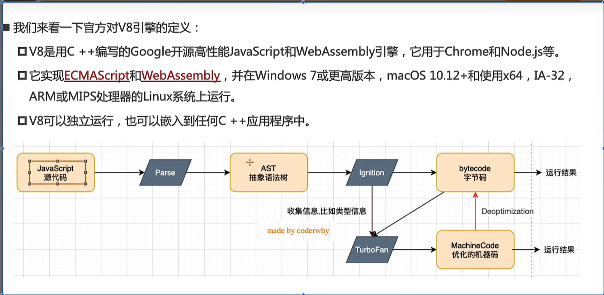
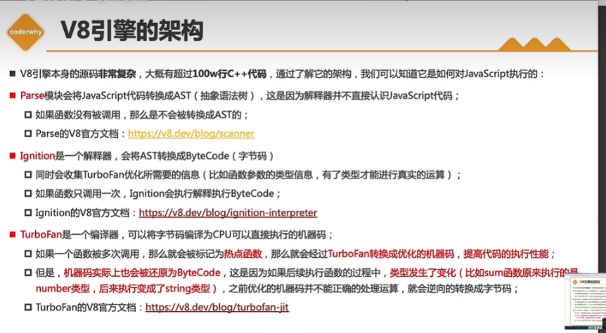

<!--
 * @Author: “liwx” “1258598654qq.com”
 * @Date: 2025-05-03 13:13:04
 * @LastEditors: “liwx” “1258598654qq.com”
 * @LastEditTime: 2025-05-06 14:58:41
 * @FilePath: \webAccumulation\docs\accumulation\V8引擎.md
 * @Description: 这是默认设置,请设置`customMade`, 打开koroFileHeader查看配置 进行设置: https://github.com/OBKoro1/koro1FileHeader/wiki/%E9%85%8D%E7%BD%AE
-->

# V8 引擎



V8 引擎步骤
1、首先使用 Parse 模块将 js 代码进行词法分析和语法分析转换为抽象语法树（AST）
2、使用 Ignition 模块 将抽象语法树（AST）转换为字节码（bytecode）,字节码是跨平台的，可以转换为不同 cpu 的机器码，进行处理
3、如果有段代码被多次使用，由 ignition 收集函数执行信息，如果发现该段代码执行频繁，则标记为 hot.由 TurboFan 将字节码转换为机器码，提高执行效率
4、如果发现机器指令的操作不一样了，反向优化，将机器码转化为字节码，再进行运行
例如：

```js
function sum(a, b) {
  return a + b;
}
sum(1, 2);
sum(3, 4);
sum('hellow', 'world)
```

运行`sum('hellow', 'world)`时，由于机器码与原来的不同，TurboFan 会进行反向编译，重新生成字节码，再进行运行

1、首先使用 Parse 库将 js 代码进行词法分析和语法分析转换为抽象语法树（AST）
2、使用 Ignition 将抽象语法树（AST）转换为字节码,字节码是跨平台的，可以转换为不同 cpu 的机器码，进行处理

V8 架构



# js 代码在 js 引擎中的执行过程

1. 代码被解析

- 1.1、V8 引擎内部会创建一个对象 Global Object（GO），该对象是全局对象，包含(window、console、setTimeout、Date、Number 等)内置对象，所有的全局变量（默认为 undefined,执行时再进行赋值）和函数都会作为该对象的属性和方法，该对象会在代码执行前创建。

- 1.2、如果是函数，则创建一个函数对象（AO），该对象包含函数的父级作用域（parent scope）、函数执行体（函数的代码，函数的参数，函数的返回值）等，该对象会在代码执行前创建。

2.  运行代码

- 2.1. 为了执行代码，会先创建一个执行上下文栈（Execution Context Stack）（函数调用栈）
- 2.2. 因为我们执行的是全局代码，需要创建 全局执行上下文（Global Execution Context），其中有个 VO(Variable Object)变量对象指向 GO
- 2.3、函数的调用。在 ECStack 中创建函数执行上下文（Function Execution Context），在内存中创建一个 AO（Activation Object）活动对象(VO)，AO 中包含函数的参数，函数的局部变量，函数的 this 等。然后开始执行函数中的代码。函数执行完毕后，首先函数执行上下文会从调用栈中弹出，并销毁。AO 也会销毁

-
