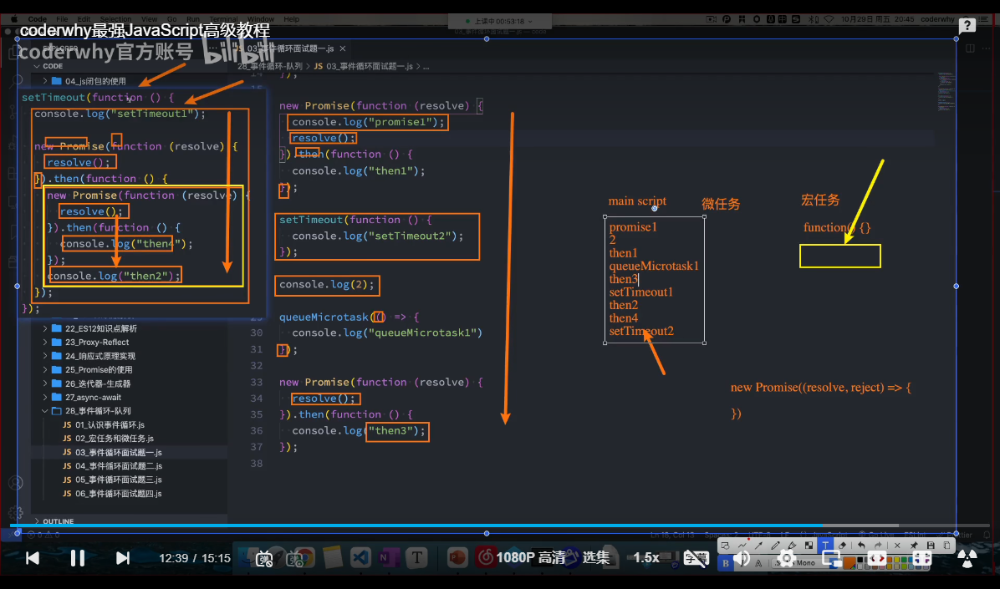
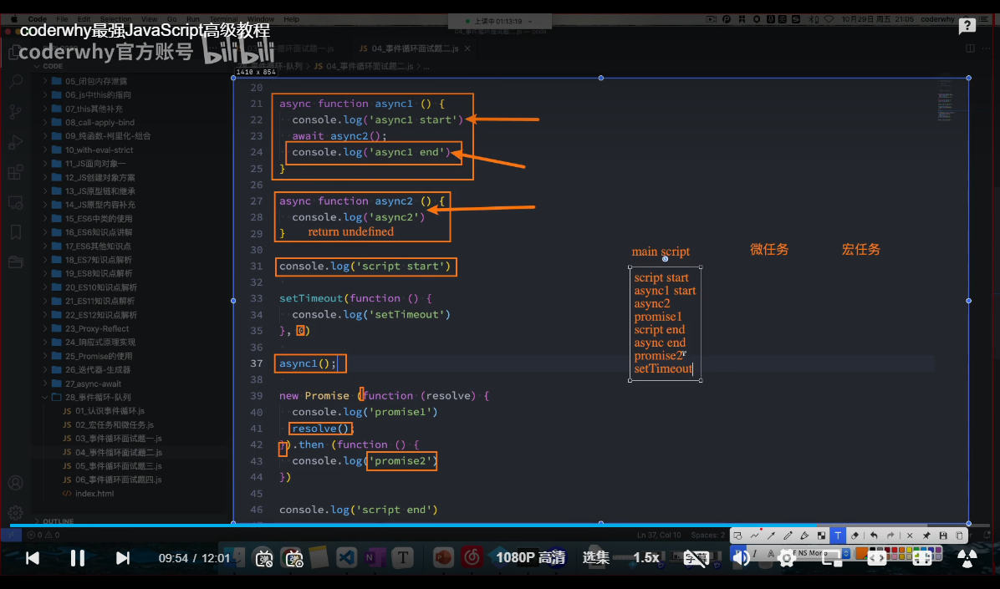
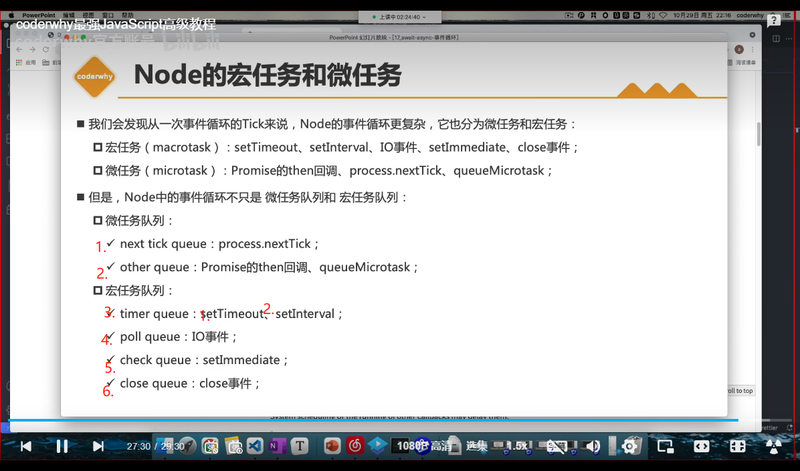

<!--
 * @Author: “liwx” “1258598654qq.com”
 * @Date: 2025-04-30 18:10:42
 * @LastEditors: “liwx” “1258598654qq.com”
 * @LastEditTime: 2025-07-10 14:16:49
 * @FilePath: \webAccumulation\docs\accumulation\eventLoop.md
 * @Description: 这是默认设置,请设置`customMade`, 打开koroFileHeader查看配置 进行设置: https://github.com/OBKoro1/koro1FileHeader/wiki/%E9%85%8D%E7%BD%AE
-->

# 浏览器事件循环

js 线程+浏览器其他线程+队列之间的循环组成了浏览器事件循环

## 进程和线程

进程：启动一个应用程序，就会默认启动一个进程

线程：每一个进程中，启动至少一个线程，用于执行程序中的代码，这个线程被称为主线程

**进程是线程的容器**

浏览器是多线程的，js 线程只是其中之一。javascript 是单线程的，但是可以开启多进程。如果比较耗时的操作，不交给 js 线程，交给其他线程，其他线程执行完毕后，再告诉 js 线程，js 线程只负责执行回调函数

## 浏览器的事件循环

## 微任务和宏任务

**宏任务执行之前，会先执行所有的微任务**

宏任务：ajax、 setTimeout、setInterval、setImmediate、I/O、UI rendering
微任务：Promise.then、process.nextTick、MutationObserver、queueMicrotask

全局代码（main script）优先执行，然后检查微任务队列，执行微任务，然后检查宏任务队列，执行宏任务，然后检查微任务队列，执行微任务，然后检查宏任务队列，执行宏任务，如此往复

**注意：new Promise 不是微任务，Promise.then 才是微任务。new Promise(()=> {})中的代码是直接执行的**

面试题 1

面试题 2

面试题 3

# Node 的事件循环

libuv 维护了一个 event loop 和 worker threads 池（线程池）

## node 的事件循环分为 6 个阶段

经常会停留在 I/O 阶段，因为大部分异步任务都在这个阶段执行

## node 的宏任务和微任务

- 宏任务：Ajax、setTimeout、setInterval、setImmediate、I/O、UI rendering、DOM 事件、关闭回调
- 微任务：process.nextTick（优先执行）、Promise.then、MutationObserver、queueMicrotask

**node 微任务和宏任务执行顺序**

## node 的事件循环和浏览器的事件循环的区别

1. 浏览器的事件循环是宏任务和微任务交替执行，node 的事件循环是宏任务和微任务交替执行，但是宏任务之间不是交替执行，而是顺序执行
2. node 的事件循环是 6 个阶段，浏览器的事件循环是 2 个阶段
