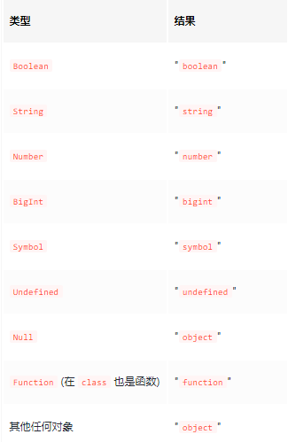
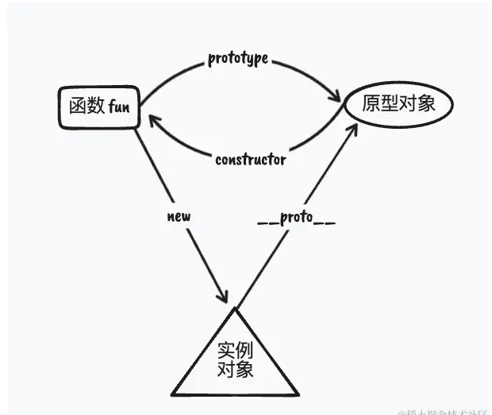
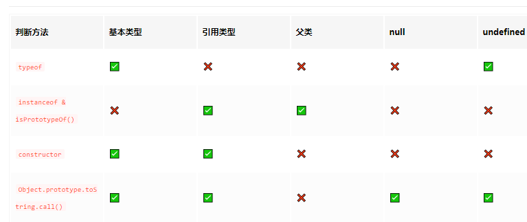

# JS 中四种常见的数据类型判断方法

在`js`中，有四种常见的数据类型判断方法

1. typeof
2. instanceof 和 isprototype()
3. constructor
4. Object.prototype.toString.of

## 一、typeof

> typeof 运算符返回一个字符串，标识操作对象的类型：typeof 操作类型

**1.常见类型对应的 `typeof` 返回值**



代码示例如下：

```js
console.log(typeof true) // boolean
console.log(typeof '123') // string

console.log(typeof 11111) // number
console.log(typeof Math.LN2) // number
console.log(typeof Infinity) // number
console.log(typeof NaN) // number

console.log(typeof BigInt(11111)) // bigint
console.log(typeof Symbol(1111)) // symbol
console.log(typeof undefined) // undefined
console.log(typeof null) // object

console.log(typeof (() => {})) // function
console.log(typeof class {}) // function

console.log(typeof {}) // object
console.log(typeof []) // object
console.log(typeof /abc/) // object
console.log(typeof new Date()) // object
console.log(typeof new Promise(() => {})) // object
```

**2.为什么`typeof null` 返回的是`Object`**

1. 在 `js`的最初实现中，JS 中的值是由已给表示类型的`标签`和`实际数据值`表示的，对象的`类型标签`是`0`,由于 null 代表的空指针，在大多数平台下值表示为`0x00`因此，`null`的标签类型是`0`.所以`typeof null`返回的就是`Object`

**3.为什么`typeof (()=>{})`返回的是`function`**

`function` 实际上是 `Object` 的的一个子类型，更深点的说，函数是一个可以被调用的对象；那么他为什么能被调用呢？那是因为其内部实现了 `call` 方法，当函数被调用时会执行内部的 `call` 方法

回到正题，为什么`typeof (()=>{})`会返回 function 呢？这里主要还是要看 Es6 中 typeof 是怎么区分函数和对象的

- 一个对象如果没实现了 call 内部方法，那么就返回 object
- 一个对象如果实现了 call 内部方法，那么他就返回 function

## 二、instanceof 和 isPrototypeOf()

> 在 JS 中有`两种方法`可以判断`原型`是否存在于某个实例的`原型链`上，通过这种判断就可以帮助我们确定`引用数据`的具体类型；需要注意的是：该两种方法`只能判断引用数据，不能判断基本类型`

### instanceof

1. **介绍：** `instanceof`用于检测构造函数的`prototype`属性是否出现在某个实例对象的`原型链`中

2. **语法：** `实例对象instanceof 构造函数`，返回的是一个`boolean`值

3. **示例：**

```js
function Car(name) {
	this.name = name
}
const auto = new Car('haha')

auto instanceof Car //true
auto instanceof Object // true
```

### Object.prototype.isPrototypeOf()

1. **介绍：** isPrototypeof()方法用于检查一个对象是否存在于另一个对象的原型链中

2. **语法：** 原型.isPrototypeof(实例)

3. **示例：**

```js
function Car() {}
const auto = new Car()
Car.prototype.isPrototype(auto) //true
Object.prototype.isPrototype(auto) //true
```

### 三、 根据 constructor 进行判断

constructor 判断方法跟 instanceof 相似，如下图是`原型`，`示例`，`构造函数`之间的关系图，从图中可知，在`实例对象`的原型中存在`constructor`指向`构造函数`



```js
function Car() {}
const auto = new Car()
auto.constructor === Car //true
```

不同于`instanceof`,通过该方式，既能处理`引用数据`，又能处理`基本数据`

```js
;(123).constructor === Number // true
```

不同于 `instanceof` ，不能判断`父类`

```js
class A {}

class B extends A {}

const b = new B()

b.constructor === B // true
b.constructor === A // false

b instanceof B // true
b instanceof A // true
```

**注意：`null` 和 `undefined` 没有 `constructor` 所以无法检测 `Null` 和 `Undefined`**

## 四、Object.prototyp.toString.call()

`Object.prototyp.toString.call()` 方法返回一个表示该对象的字符串，该对象的格式为`[Object Type]`,这里的 `Type` 就是对象的类型

```js
const toString = Object.prototype.toString

toString.call(111) // [object Number]
toString.call(null) // [object Null]
toString.call(undefined) // [object Undefined]

toString.call(Math) // [object Math]
toString.call(new Date()) // [object Date]
toString.call(new String()) // [object String]
```

**注意：**对于自定义构造函数实例化出来的对象，返回的事`[Object Object]`

```js
const toString = Object.prototype.toString
function Bar() {}

toString.call(new Bar()) // [object Object]
```

**补充：**一个通用方法，一行代码获取`数据类型`

```js
const getType = data => {
	return Object.prototype.toString.call(data).slice(8, -1).toLocaleLowerCase()
}
```

## 五、总结



1. `typeof`适用于判断基本类型，特别注意的是`Null`会返回`Object`,`Function`返回 `function` 其余引用类型返回的都是 `Object`

2. `instanceof` 或者 `isPrototype()`可以判断引用类型，同时可判断父类
3. `constructor`可以判断基恩类型、引用类型，但是不可以判断 `null`,`undefined`,并且无法判断`对象父类`
4. `Object.prototype.toString.call()`万能方法，对局 js 所有类型都能识别出来，唯一不足的就是不能判断对象父类
