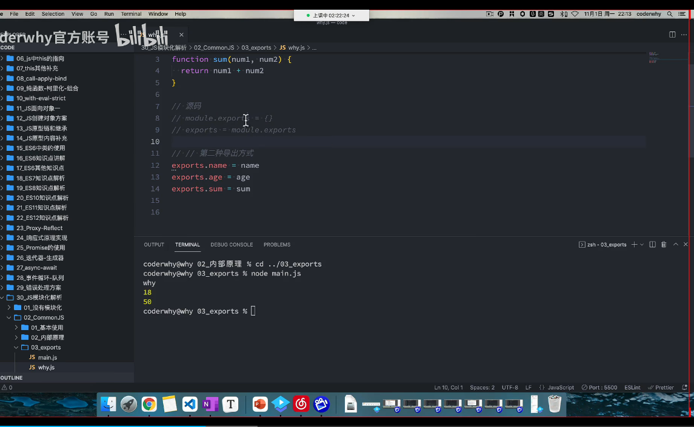
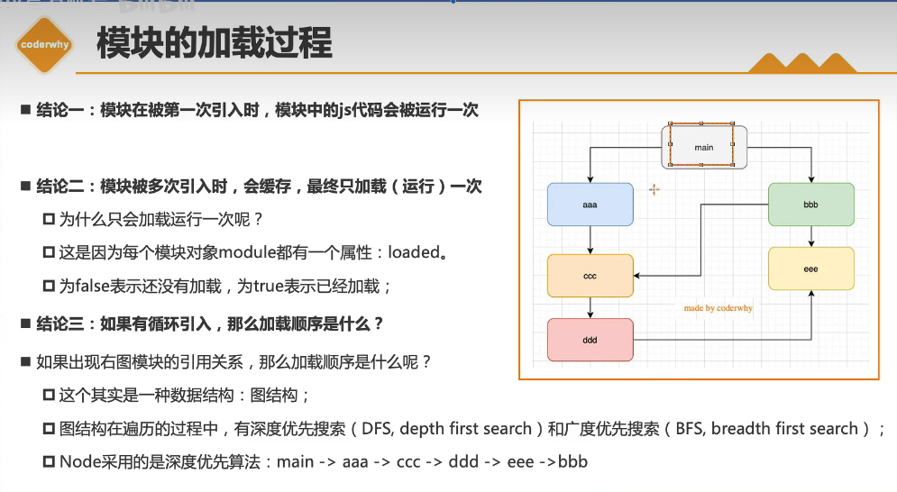
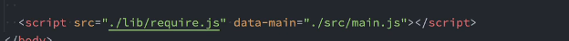

<!--
 * @Author: “liwx” “1258598654qq.com”
 * @Date: 2025-05-02 09:02:01
 * @LastEditors: “liwx” “1258598654qq.com”
 * @LastEditTime: 2025-05-02 13:31:38
 * @FilePath: \webAccumulation\docs\accumulation\模块化.md
 * @Description: 这是默认设置,请设置`customMade`, 打开koroFileHeader查看配置 进行设置: https://github.com/OBKoro1/koro1FileHeader/wiki/%E9%85%8D%E7%BD%AE
-->

# 模块化


## commonJS

它是一种规范，node 是其中的一种实现，为了在浏览器以外来使用的，所以会有一些限制，比如同步加载，因为浏览器不支持同步加载，所以需要一些工具来支持，比如 webpack，browserify


**导出方法**

1、module.exports = {} 导出对象.module 是当前模块的对象，它里面有个 exports 属性，用来导出模块

```js
const a = 1;
const b = 2;
module.exports = {
  a,
  b,
};

// 导入使用
const { a, b } = require('./a.js');
console.log(a, b);
```

**内部原理**
将返回的 info 对象，赋值给 module.exports。require 是一个函数，主要的作用是根据输入的文件，拿到 module.exports 的值，返回给调用者


2.exports 导出对象，exports 是 module.exports 的引用

```js
const a = 1;
const b = 2;
exports = {
  a,
  b,
};

// 导入使用
const { a, b } = require('./a.js');
console.log(a, b);
```

**源码；**



**require 的查找规则**

导入格式：require(X)

1. 如果 X 是核心模块（http、fs(fileSystem)、path 等），则返回核心模块，并且停止查找
2. 如果 X 是以 ./ 或 ../ 或 /（根目录）开头的，根据 X 的路径去文件系统中定位文件.如果没有后缀名，会按照如下顺序：

- 直接查找文件 X
- 查找 X.js
- 查找 X.json
- 查找 X.node
  如果没找到文件，再按照文件夹查找，默认查找 X/index 文件

3. 如果 X 不是路径也不是核心模块，则 node 会从当前模块的父目录开始，尝试从它的 /node_modules 目录里加载模块。如果没有找到，则移动到再上一级父目录，直到文件系统的根目录


4. 如果在以上过程中都未找到，则会抛出异常

**commonJS 的加载过程**

1、模块第一次被引用时，模块中的 js 代码都会被运行一次，然后缓存

2、被多次引用，有缓存

> 每个模块对应自己的 module 实例，里面有个 loaded 属性，false 为从未加载过，true 表示已经加载。用来标识模块是否被加载过，加载过则直接返回，没有则加载

3、如果有循环引用，则按照顺序执行，执行完再返回



**commonJS 的缺点**

1、同步加载，浏览器不支持同步加载，所以需要一些工具来支持，比如 webpack，browserify

2、没有私有变量，所有变量都是共享的，污染全局作用域

3、循环引用，会导致死循环

## AMD

AMD 是异步加载模块，requireJS 是 AMD 的实现，AMD 是 requireJS 在浏览器端的实现，requireJS 是一个第三方库，用来解决浏览器端模块化的问题



data-main 是一个属性，用来指定加载的 js 文件，src 加载完成后，立即加载 index.js

AMD 的使用

```js
// 方式1
// 定义模块
define(function (module2) {
  return {
    start: function () {
      module2.start();
      console.log('module1 start');
    },
  };
});
// 引用模块
require.config({
    baseUrl: './src',
  paths: {
    module1: './module1',
    module2: './module2',
  },
});

require(['module1', 'module2'], function (module1, module2) {
  module1.start();
  module2.start(
})
// 方式二
// 定义模块 依赖module2模块
define('module1', ['module2'], function (module2) {
  return {
    start: function () {
      module2.start();
      console.log('module1 start');
    },
  };
});

// 引入模块
require(['module1'], function (module1) {
  module1.start();
});
```

# ES Module

ES Module 使用的是 import 和 export

export 导出模块，import 引入模块

采用 ES Module 代码自动开启严格模式

必须加 type=module,否则不是一个模块

```js
<script type="module" src=''>
```

**导出方式 1**

```js
export const a = 1;
export const b = 2;
export function start() {
  console.log('start');
}
```

**导出方式 2**
export 是一个语法，不是一个对象

```js
const a = 1;
const b = 2;
function start() {
  console.log('start');
}
export { a, b, start };
```

**导出方式 3**,方式二取别名

```js
export { a as a1, b as b1, start as start1 };
```

**导出方式 4**,导出默认，一个模块只能有一个默认导出

```js
export default {
  a,
  b,
  start,
};
```

**导出方式 5**

```js
export default function () {
  console.log('start');
}
```

**导出方式 6**

export default {
aaa(){

    }

}

**导入方式 1**

```js
import { a, b, start } from './a.js';
console.log(a, b);
start();
```

**导入方式 2**,取别名

```js
import * as module1 from './a.js';
```

**导入方式 3**，将导出的所有内容放到一个标志符中

```js
import foo from './foo.js';
foo.a;
```

**导入方式 4**,动态导入，返回一个 promise

```js
import('./foo.js').then((module) => {
  module.a;
});
```
