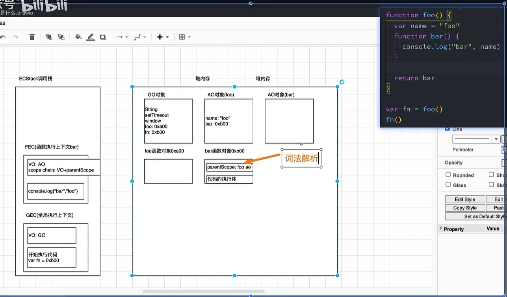

# 闭包

词法闭包、函数闭包

**闭包是一个函数+它能访问的自由变量**，每当创建一个函数，就会在函数创建时生成一个闭包。

**执行顺序**

1、代码编译阶段生成一个 GO，存储变量名和变量地址。遇到函数，创建`函数对象`(函数名、函数体、函数参数、函数返回值、函数作用域链（词法解析的时候就确定了）、函数上下文)

2、代码执行首先在执行栈里创建一个`全局执行上下文`，然后执行全局代码，遇到函数，创建`函数执行上下文`，其中有个 `VO+scope chain(VO+parent scope（指着上层作用域的AO）)`。然后执行函数，先创建 AO 对象，`VO 指向 AO`，然后执行函数代码，遇到变量，先在 AO 里找，找不到，再在 VO 里找，找不到，再在全局执行上下文里找，找不到，报错。函数执行完毕后，执行栈中的`函数上下文会`被销毁

3、执行 bar 时，依然能访问 foo 中的 name,闭包就形成了。

bar 以及能访问的自由变量，形成了闭包

