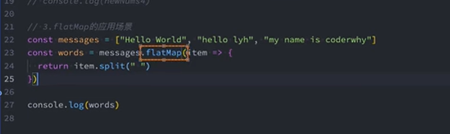

# ES7 新增的常用方法

## Array.includes

可以判断 NaN,传统的 indexof()不能正确判断 NaN

## 指数运算符

```js
//  之前
const result = Math.pow(2, 10);
// ES7
const result = 2 ** 10;
```

# ES8

## Object.values

获取对象所有的 value 值

```js
let obj = {
  name: 'a',
  age: 19,
};
console.log(obj.values()); // [ 'a', 19 ]
console.log(Object.values(['a', 'b'])); // [ 'a', 'b' ]
console.log(Object.values('abc')); // [ 'a', 'b', 'c' ]
```

## Object.entries

获取对象的键值对`[[key1,value1],[key2,value2]]`

```js
let obj = {
  name: 'a',
  age: 19,
};
console.log(Object.entries(obj)); // [ [ 'name', 'a' ], [ 'age', 19 ] ]
// 数组，索引值为key
console.log(Object.entries(['a', 'b'])); // [ [ '0', 'a' ], [ '1', 'b' ] ]
// 字符串，每个字符索引值为key
console.log(Object.entries('abc')); // [ [ '0', 'a' ], [ '1', 'b' ], [ '2', 'c' ] ]
```

## String.Padding(填充)

对字符串前后填充，`padStart` 在前面填充，`padEnd` 在后面填充

### String.padStart

```js
const str = 'abc';
console.log(str.padStart(5, 'x')); // xxabc
console.log(str.padEnd(5, 'x')); // abcxx
```

### String.padEnd

```js
const str = 'abc';
console.log(str.padStart(5, 'x')); // xxabc
console.log(str.padEnd(5, 'x')); // abcxx
```

## 函数参数默认值

```js
function fn(q, b) {}
fn(1, 2);
```

## async/await

## Object.getOwnPropertyDescriptors 和 Object.setOwnPropertyDescriptors

获取对象所有的属性描述符，设置对象所有的属性描述符

```js
const obj = {
  name: 'a',
  age: 19,
};
const descriptors = Object.getOwnPropertyDescriptors(obj);
console.log(descriptors);
```

# ES9(ES2018)

## Async 函数的修饰符

## Promise.finally

# ES10

## flat flatMap(降维)

对数组降维，`flatMap` 会先执行 map 方法，再执行 flat 方法,默认是 1，一次降维

```js
const arr = [1, 2, 3, [4, 5, 6]];
console.log(arr.flat(2)); // [ 1, 2, 3, 4, 5, 6 ]
```

flatMap(callback, thisArg) 生成新的数组
callback:回调函数
thisArg：绑定 this
flatMap 的应用的应用场景


## Object.fromEntries

将键值对数组转换为对象

```js
const arr = [
  ['name', 'a'],
  ['age', 19],
];
console.log(Object.fromEntries(arr)); // { name: 'a', age: 19 }
```

应用场景：


## trimStart trimEnd

去除字符串前后的空格

```js
const str = '  a  ';
console.log(str.trimStart()); // 'a  '
console.log(str.trimEnd()); // '  a'
```

## Symbol.description

获取 Symbol 的描述

```js
const s = Symbol('a');
```

# ES11

## BigInt

早些时候不能正确表示大于 `MAX_SAFE_INTEGER` 的整数，现在可以了

```js
// ES11之前
const max = Number.MAX_SAFE_INTEGER;
console.log(max + 1); // 9007199254740992
console.log(max + 2); // 9007199254740992

// 之后,最后添加n,表示是BigInt类型
const max = 9007199254740992n;
// 普通数字和大数字不能直接计算
const max = MAX_SAFE_INTEGER;
console.log(max + 1n);

const n = 100;
console.log(max + BigInt(n)); // 9007199254740993n
```

## Nullish Coalescing Operator(空值合并运算符)

当左侧操作数为 null 或 undefined 时，返回右侧操作数，否则返回左侧操作数

```js
// ES11之前
const a = 0 || 1;
console.log(a); // 1
const b = null || 1;
console.log(b); // 1
const c = undefined || 1;
console.log(c); // 1
const d = '' || 1;
console.log(d); // ''
const e = false || 1;
console.log(e); // false
// ES11
const f = null ?? 1;
console.log(f); // 1
const g = undefined ?? 1;
console.log(g); // 1
const h = '' ?? 1;
console.log(h); // ''
const i = false ?? 1;
console.log(i); // false
const j = 0 ?? 1;
console.log(j); // 0
```

## Optional Chaining(可选链运算符)

```js
const obj = {
  name: 'a',
  age: 19,
  friend: {
    name: 'b',
  },
};
// ES11之前
console.log(obj.friend.name); // b
console.log(obj.friend.friend.name); // 报错
// ES11
console.log(obj.friend?.friend?.name); // undefined
```

## GlobalThis

获取全局对象.浏览器获取的是 window，node 获取的是 global

```js
console.log(GlobalThis);
```

## 对 for...in 做了标准化

遍历对象的可枚举属性，规定 key 为对象的 key

```js
const obj = {
  name: 'a',
  age: 19,
};
for (const key in obj) {
  console.log(key); // name age
}
```

# ES12

## finalizationRegistry

垃圾回收机制，可以监听对象被垃圾回收的时候，做一些事情

```js
const registry = new FinalizationRegistry((value) => {
  console.log(value, '注册在registry的对象被垃圾回收了');
});
const obj = { name: 'a' };
const age = { age: 19 };
// 注册对象，obj为对象，'obj'为标记.registry.register(obj,value)
registry.register(obj, 'obj');
registry.register(age, 'age');
// 手动设为null，下次垃圾回收的时候会被销毁
obj = null;
```

## WeakRef

弱引用，可以引用对象，但是不会阻止垃圾回收

> WeakRef.prototype.deref() 返回当前实例的 WeakRef 对象所绑定的 target 对象，
> 如果该 target 对象已被 GC 回收则返回 undefined

```js
const obj = { name: 'a' };
const weakObj = new WeakRef(obj);

console.log(weakObj.deref()); // { name: 'a' }
```

## logicalAssignment(逻辑赋值运算符)

> `!!=` 逻辑或赋值运算

```js
let message = undefined;
// 原来
message = message || 'default value';
// ES12
message !!= 'default value'

```

> `&&=` 逻辑与赋值运算

```js
let message = undefined;
// 原来
message = message && 'default value';
// ES12
message &&= 'default value';
```

> `??=` 逻辑空赋值运算

```js
let message = '';
// 原来
message = message ?? 'default value';
// ES12
message ??= 'default value';
```

## replaceAll

> replaceAll(searchValue, replacement)

```js
const str = 'abcabc';
console.log(str.replaceAll('a', 'd')); // ddbcd
```
