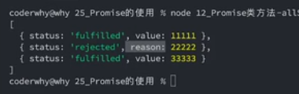

# Promise

是一种规范，承诺

> 产生背景：解决
> 1、 回调地狱
> 2、 沟通成本高

原先：

```js
// successCallback成功, errorCallback失败。只是一种解决方案，并不是一种规范
function request(url, successCallback, errorCallback) {}
```

ES6-Promise:

```js
// 传入的函数被称为executor并立即执行,resolve成功回调，reject失败回调
const promise = new Promise((resolve, reject) => {
  // 异步操作
  if (/* 异步操作成功 */) {
    // 调用resolve函数，表示promise对象已经成功完成。进入then第一个回调
    resolve(value);
  } else {
    // 调用reject函数，表示promise对象运行失败。进入then第二个回调
    reject(error);
    throw new Error(error);
  }
});

promise.then((value) => {
// 成功
},(error) => {
// 失败
})

```

## Promise 的状态

执行 executor 函数时，Promise 实例处于 pending 状态，一旦调用 resolve 或 reject，Promise 实例的状态就变为 fulfilled 或 rejected，这时称为 resolved（已定型）。

1. pending: 初始状态，不是成功，也不是失败状态。
2. fulfilled: 意味着操作成功完成。
3. rejected: 意味着操作失败。

**注意：**

1.  如果 resolve 的参数是 Promise 对象，那么这个 Promise 对象的状态会传递下去。由新的 Promise 来决定。原来的 Promise 状态不会改变。
2.  如果 resolve 的参数是一个包含 then 方法的 Object,那么状态是由 then 方法来决定的

## Promise 的方法

1. then: 对象方法,放在了原型上 promise.prototype.then()先 new 一个 promise 对象 promise.then(onFulfilled, onRejected).
   - then 方法可以有返回值，如果返回值是普通类型返回的是一个新的 Promise 对象
   - 如果返回的是一个新的 Promise 对象，那么这个 Promise 对象的状态由这个新的 Promise 决定
   - 如果返回的是对象，并且对象实现了 then 方法，返回的是新 promise,状态由 then 函数决定
   ```js
   promise.then((res) => {
     return {
       then: (resolve, reject) => {
         resolve();
       },
     };
   });
   ```
2. catch: 对象方法。

```js
// 方法一
promise.then(
  (res) => {},
  (err) => {}
);
// 方法二，这里的catch是优先捕获promise的，如果promise没有捕获到，才会捕获到then的
promise.then().catch((err) => {});
```

- 有返回值，也是返回的 Promise 对象，创建一个新的 promise 对象，调用 resolve 方法
  

3. finally: 对象方法。ES9 新增的，不管成功还是失败都会被执行一次。
4. resolve: 静态方法（类方法），返回一个状态为 fulfilled 的 Promise 对象。

```js
// 普通值
const promise = Promise.resolve({ name: 'zyl' });
//传入Promise
const promise = Promise.resolve(new Promise((resolve, reject) => {
  resolve('success')
});
```

5. reject: 静态方法（类方法），返回一个状态为 rejected 的 Promise 对象。
   **无论传入什么。传什么抛出什么，不区分普通值和 Promise**
6. Promise.all: 接收一个 Promise 实例的数组，返回一个新的 Promise 实例，只有当数组中所有的 Promise 实例都成功时，返回的 Promise 实例才会成功，只要有一个失败，返回的 Promise 实例就会失败。**最终结果按照调用顺序返回，和单独 promise 返回结果顺序无关**。如果其中有一个变成 rejected，那么整个 Promise 就会变成 rejected。

```js
Promise.all([promise1, promise2, promise3])
  .then((res) => {
    // 所有promise都成功
  })
  .catch((err) => {
    // 只要有一个失败
  });
```

7.  Promise.allSettled: ES11 新增，接收一个 Promise 实例的数组，返回一个新的 Promise 实例，只有当数组中所有的 Promise 实例都返回结果，**不管是成功还是失败，返回的 Promise 实例才会返回结果**。

返回结果格式：



8.  Promise.race: 接收一个 Promise 实例的数组，返回一个新的 Promise 实例，一旦数组中的某个 Promise 实例率先改变状态，返回的 Promise 实例的状态就会改变。

9.  Promise.any: ES12 新增，接收一个 Promise 实例的数组，返回一个新的 Promise 实例，只要数组中有一个 Promise 实例成功，返回的 Promise 实例就会成功，只有全部失败，返回的 Promise 实例才会失败。
