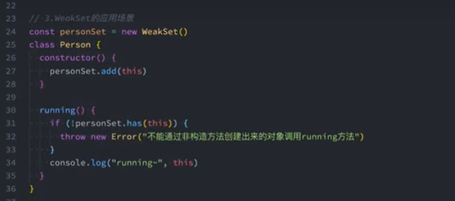
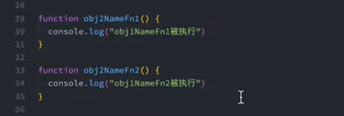
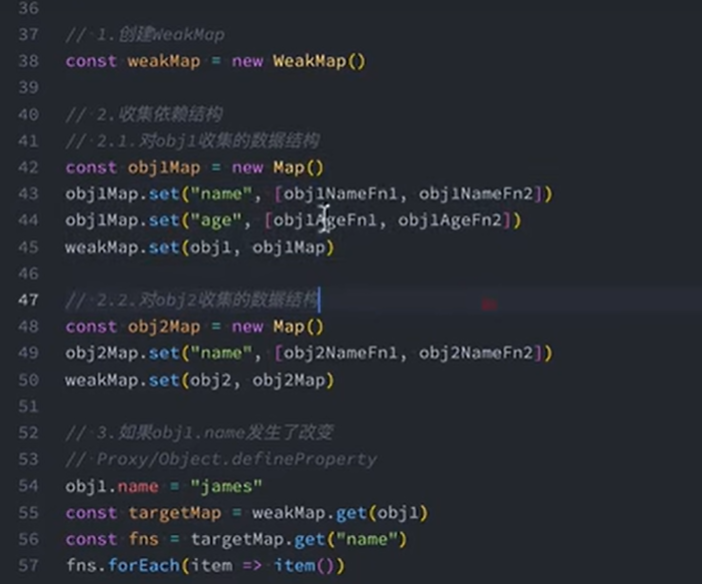

# ES6 Set 和 Map 数据结构

## Set

ES6 提供了新的数据结构 Set.他类似于数组，但是成员的值是唯一的，没有重复值

Set 本身是一个构造函数，用来生成 Set 数据结构

```js
let arr = new Set();
[(1, 2, 3, 3, 2, 1)].map((x) => arr.add(x));

arr.forEach((x) => console.log(x)); // 123
```

**Set 示例的属性和方法**

Set 结构的实例有一下属性：

- `Set.prototype.constructor`:构造函数，默认 为 Set 函数
- `Set.prototype.size` ：返回 Set 是来的成员总数

Set 示例方法分为两大类：`操作方法`和`遍历方法`

> 操作方法：
>
> - add()：添加某个值，返回 Set 结构本身;
> - delete()：删除某个值，返回一个布尔值，表示删除成功;
> - has()：返回一个布尔值，表示改制是否为 Set 的成员;
> - clear()：清楚所有成员，没有返回值;

**遍历操作**

Set 结构的实例有四个遍历方法：
.keys():返回键名数组
.values():返回键值的数组
.entries():返回键值对的数组
.forEach()：使用回调函数遍历数组每个成员

需要注意的是**Set 的遍历顺序就是插入顺序**这个特性非常重要，比如使用 Set 保存一个回调函数列表，调用时就能保证按照添加顺序调用

（一） keys() value() entries()

keys value entries 方法返回的都是遍历器对象。由于 Set 结构没有键名，只有键值（或者说键名和键值是同一个值），所以 key 和 value 方法的行为是一样的

```js
let s = new Set(['a', 'b', 'c']);
s.keys.forEach((x) => console.log(x)); //a b c

s.values.forEach((x) => console.log(x)); // a b c

s.entries.forEach((x) => console.log(x)); //['a','a'] ['b','b'] ['c','c']
```

(二) forEach 方法

Set 结构的实例 forEach 方法，用于对每个成员执行某种操作，没有返回值

(三) 遍历的应用

扩展运算符（...）内部使用 for ... of 循环，所以也可以用于 Set 结构

```js
let s = new Set([1, 2, 3]);
let arr = [...s]; // [1,2,3]
```

扩展运算符和 set 结合可以去重

```js
let arry = [1, 2, 2, 3];
let a = [...new Set(arry)]; // 1,2,3
```

对象数组去重

```js
    unique(arr) {
      const res = new Map()
      return arr.filter((arr) => !res.has(arr.id) && res.set(arr.id, 1))
    }
```

而且，数组的 `map` 和 `filter` 方法也可以用于 `Set`

```js
let set = new Set([1, 2, 3]);
set = new Set([...set].map((x) => x * 2)); // 返回Set结构：{2, 4, 6}

let set = new Set([1, 2, 3, 4, 5]);
set = new Set([...set].filter((x) => x % 2 == 0)); // 返回Set结构：{2, 4}
```

因此使用 Set 很容易实现交集、并集、和差集

```js
let a = new Set([1, 2, 3]);
let b = new Set([4, 3, 2]);

// 并集
let union = new Set([...a, ...b]);
// Set {1, 2, 3, 4}

// 交集
let intersect = new Set([...a].filter((x) => b.has(x)));
// set {2, 3}

// 差集
let difference = new Set([...a].filter((x) => !b.has(x)));
// Set {1}
```

<!-- 对象数组取交集，并集，差集

```js

``` -->

## WeakSet

**不能被遍历**

WeakSet 结构与 Set 类似 ,也是不重复的值的集合。但是，它与 Set 有两个区别

**首先**,WeakSet 成员只能是对象，不能是其他类型的值

**其次**,WeakSet 的对象都是**弱引用**，即垃圾回收机制不考虑 WeakSet 对该对象的引用，也就是说，如果其他对象不再引用该对象，那么垃圾回收机制会自动回收该对象所占用的内存，不考虑该对象还存在于 WeakSet 之中。这个特点意味着，无法引用 WeakSet 的成员，因此 WeakSet 是不可遍历的

> 应用场景：
>
> 1、WeakSet 可以用来储存 DOM 节点，而不用担心这些节点从文档移除时，会引发内存泄漏
>
> 2、将构造函数创建的 this,作为 WeakSet 的实例，这样就可以避免外部通过 this 访问实例的属性



## Map

ES6 提供了 `Map` 数据结构。它类似于对象，也是键值对的集合，但是“键”的范围不限于字符串，各种类型的值（包括对象）都可以当作键。也就是说，Object 结构提供了“字符串—值”的对应，`Map` 结构提供了“值—值”的对应，是一种更完善的 Hash 结构实现。如果你需要“键值对”的数据结构，`Map` 比 `Object` 更合适。

```js
const m = new Map();
const o = { p: 'Hello World' };

m.set(o, 'content');
m.get(o); // "content"
```

常见方法

- set(key,value)
- get(key)
- has(key)
- delete(key)
- clear()
- keys()
- values()
- entries()
- forEach()

## weakMap

> 1、key 只能是对象
>
> 2、弱引用
>
> 3、不能遍历(无 size 属性)，没有 forEach 方法

### weakMap 应用场景

1、vue3 的响应式原理




**为什么要使用 weakMap？**
如果 obj 不在被使用，那么 obj 和 dep 之间的引用关系就会断开，obj 可以被垃圾回收机制回收，如果使用 map，那么 obj 和 dep 之间的引用关系就不会断开，obj 和 dep 都不会被回收，造成内存泄漏。weakMap 的强大还包括，如果 obj 被垃圾回收机制回收，那么 obj 对应的 dep（new Map()生成的对象）也会被回收，这样就不会造成内存泄漏。
