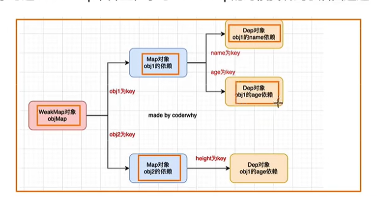

# 响应式原理

> - 1、封装响应式的函数，将需要响应式的函数传进去，对象变化后，执行回调函数
> - 2、依赖收集类的封装
> - 3、自动监听对象的变化
> - 4、依赖收集的管理，使用 weakMap 来管理，针对属性变化，只执行与该属性相关的副作用函数
> - 5、对所有对象响应式，提取 reactive 函数
>   

## Vue3 响应式原理

```js
// 1、封装响应式的函数，将需要响应式的函数传进去，对象变化后，执行回调函数
let activeReactiveFn = null;
// 定义一个监听函数
function watchFn(fn) {
  activeReactiveFn = fn;
  // 执行一次函数，收集依赖
  fn();
  activeReactiveFn = null;
}
// 封装一个获取depend的方法，target监听的对象，key变化的属性
function getDepend(target, key) {
  // 根据target和key获取depend实例
  let map = targetMap.get(target);
  if (!map) {
    map = new Map();
    targetMap.set(target, map);
  }
  let depend = map.get(key);
  if (!depend) {
    depend = new Depend();
    map.set(key, depend);
  }
  return depend;
}
// 3、创建一个响应式函数,自动监听对象的变化
function reactive(obj) {
  return new Proxy(obj, {
    get(target, key, receiver) {
      // 根据target和key获取depend依赖
      const depend = getDepend(target, key);
      // 给depend对象中添加响应式函数
      // 1、depend.addSub(activeReactiveFn);
      // 优化，将1的代码移至class中get不需要关系activeReactiveFn是否存在，class添加方法depend,操作activeReactiveFn
      depend.depend();
      return Reflect.get(target, key, receiver);
    },
    set(target, key, val, receiver) {
      //4、针对属性变化，只执行与该属性相关的副作用函数

      Reflect.set(target, key, val, receiver);
      const depend = getDepend(target, key);
      depend.notify();
      return true;
    },
  });
}
// 2、依赖收集类的封装,创建一个class,存放依赖
class Depend {
  constructor() {
    // 使用Set防止重复收集
    this.subs = new Set();
  }
  // 添加依赖，响应的函数
  addSub(sub) {
    this.subs.add(sub);
  }
  depend() {
    if (activeReactiveFn) {
      this.addSub(activeReactiveFn);
    }
  }
  // 通知依赖更新
  notify() {
    this.subs.forEach((sub) => sub());
  }
}

const proxyObj = reactive({
  name: 'zhangsa',
  age: 14,
});
let targetMap = new WeakMap();

//测试上面响应代码

watchFn(() => {
  console.log(proxyObj.name, 'name发生变化1');
  console.log(proxyObj.name, 'name发生变化2');
});
watchFn(() => {
  console.log(proxyObj.age, 'age发生变化1');
});
watchFn(() => {
  console.log(proxyObj.age, 'age发生变化2');
});

// proxyObj.name = '李四';
console.log('第二次执行-----------------');
proxyObj.age = 20;
```

## Vue2 的响应式原理

与 Vue3 相比，只有 reactive 方法不同

```js
function reactive(obj) {
  Object.keys(obj).forEach((key) => {
    let value = obj[key];
    Object.defineProperty(obj, key, {
      get() {
        console.log('get', value);
        const depend = getDepend(target, key);
        // 给depend对象中添加响应式函数
        // 1、depend.addSub(activeReactiveFn);
        // 优化，将1的代码移至class中get不需要关系activeReactiveFn是否存在，class添加方法depend,操作activeReactiveFn
        depend.depend();
        return value;
      },
      set(newValue) {
        console.log('set', newValue);
        value = newValue;
        const depend = getDepend(target, key);
        depend.notify();
      },
    });
  });
  return obj;
}
```
