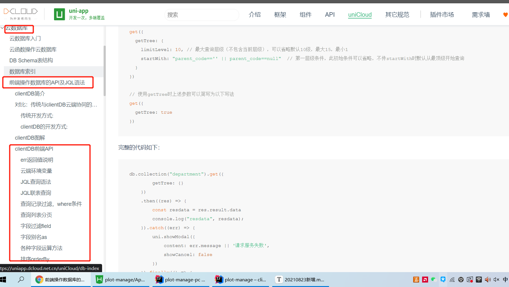

# unicloud新用法

从unicloud的官方demo中学到的知识点

### 一、多表联查

```
async getOrder() {
				uni.showLoading({
					mask: true
				});
				// 客户端联表查询
				return await db.collection('order,book') // 注意collection方法内需要传入所有用到的表名，用逗号分隔，主表需要放在第一位
					//.where('book_id.title == "三国演义"') // 查询order表内书名为“三国演义”的订单
					.field('book_id{title,author},quantity') // 这里联表查询book表返回book表内的title、book表内的author、order表内的quantity
					.get()
					.then(res => {
						this.$refs.alertCode.open(res.result)
						console.log(res.result.data,"111");
						return res.result.data
					}).catch(err => {
						console.error(err)
						return err
					}).finally(() => {
						uni.hideLoading()
					})
			}
```

### 二、where条件的写法、结果的解构

```
let {result: {deleted}} = await testDb.where('data!="不存在的条件"').remove();
```

