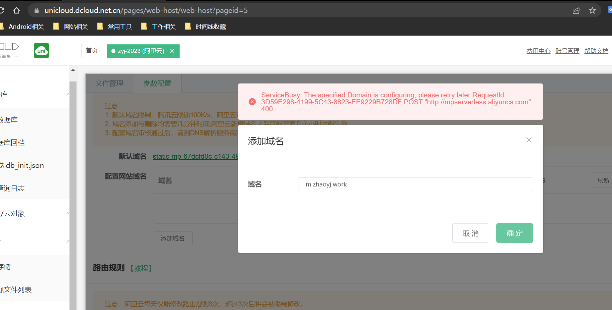
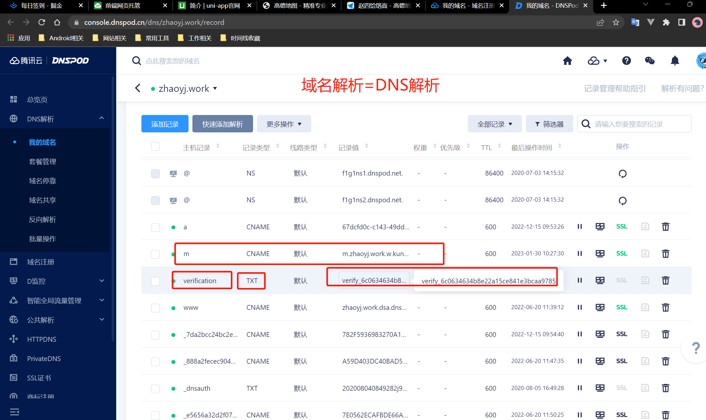
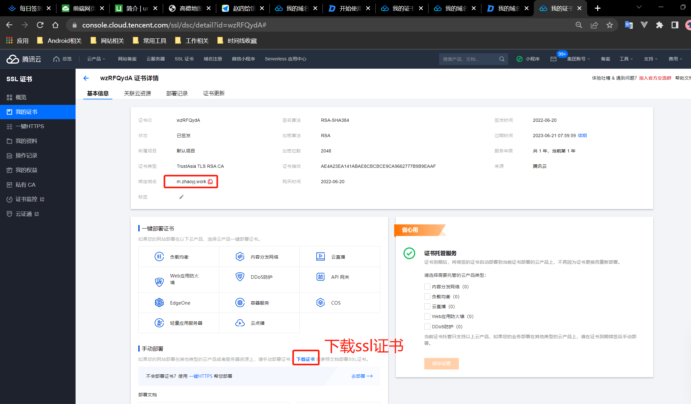
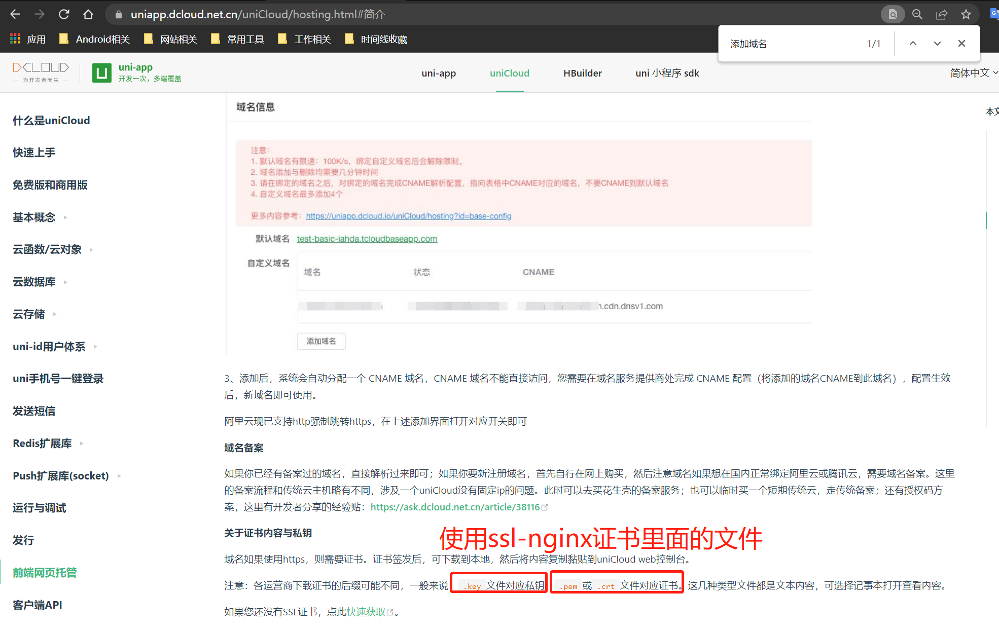
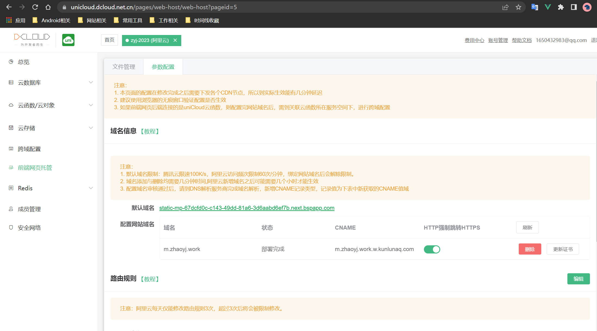

# uniapp前端网页托管

### 一、uniapp前端网页托管过程

之前在`unicloud`阿里云(公测版)的部分配置忘记了，这里不深究了。

下面的流程是`unicloud`云服务空间转成`阿里云(正式版)`后的相关配置
* 1.`unicloud`公测版转成`阿里云正式版`之后提示需要重新配置域名信息，所以将之前的配置信息删除重新添加域名信息。
这里提示`ServiceBusy`，等了一会儿后再操作就可以了。

* 2.需要在域名DNS解析里面添加`txt`类型的解析，及`CNAME`类型的解析

* 3.下载域名的证书

* 4.在`unicloud`后台配置证书信息就可以使用`https`的前缀了。

