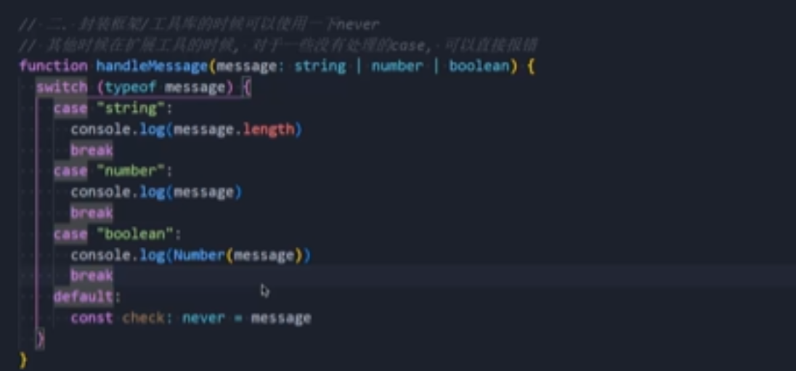
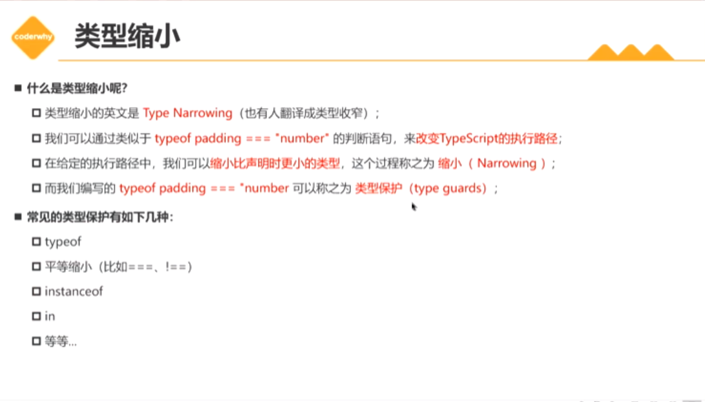
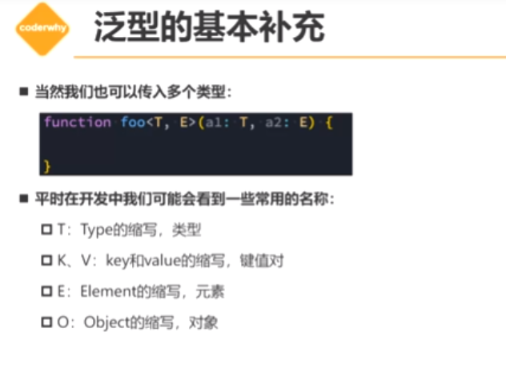

# Typescript

**ts 有类型推测，就是不必须写:类型注解，ts 会根据上下文推测出类型**

## 声明数组

```js
// 方式1
let names: string[] = [];
// 方式2(泛型)
let names: Array<string> = [];
```

## 声明对象

```js
// 方式1
let obj: {
  name: string,
  age: number,
} = {
  name: 'zs',
  age: 18,
};
// 方式2;
type/interface Person = {
  name: string,
  age: number,
};
let obj: Person = {
  name: 'zs',
  age: 18,
};
```

## 声明 null 和 undefined

```js
let n: null = null;
let u: undefined = undefined;
```

## 声明元祖 tuple

元祖数组结构中可以存放不同数据类型，取出来的也是有明确类型。

```js
let arr: [string, number, number] = ['zs', 18, 20];
```

- 使用最多的情况是函数的返回值

  ```js
  function useState(init: any): [number, (newValue: number) => void] {
    let stateValue = init;
    function setValue(newValue: any) {
      stateValue = newValue;
    }
    return [stateValue, setValue];
  }

  const [count, setCount] = useState(0);
  setCount(1);
  ```

## 声明函数

**无返回值的函数，返回值类型为 void，也可以返回 undefined,基于类型推到出来的 void，不强制一定不能有返回内容，最好不要这样做**

```js
// 方式1
let add: (x: number, y: number) => number = (x, y) => x + y;
// 方式2
type Add = (x: number, y: number) => number;
// 无返回值的函数，返回值类型为void，也可以返回undefined,基于类型推到出来的void，不强制一定不能有返回内容
// Add参数是两个number的没有返回值的函数
type Add = (x: number, y: number) => void;
const foo: Add = (x, y) => {};

function foo(fn: () => void) {
  fn();
}
```

## 构造签名

```js
class Person {}
interface ICTOTPerson {
  new(): Person; //构造签名，可以通过new方式调用，生成实例
}
function factory(ctor: ICTOTPerson): Person {
  return new ctor();
}
```

## never 类型

永远不会发生值的类型

> 场景：
>
> 1. 开发中很少用，类型推到中可能出现
> 2. 开发框架（工具）的时候，方便扩展工具的时候，直接报错,提醒开发者完善代码。如果 boolean 类型是后加的，如果没有针对 boolean 类型做处理，就会报错，never 类型就是用来做这种事情



> 3、封装类型工具

## 联合类型

用现有的类型通过运算符构建新类型

```js
let foo: number | string = 'zyl';
foo = 123;

function foo(num: number | string) {
  console.log(num);
  //   类型缩小
  if (typeof num === 'string') {
    num.toUpperCase();
  } else {
    num.toFixed(2);
  }
}

type AlignType = 'left' | 'right' | 'center';
```

## 类型别名 type

```js
type Foo = string | number;
let foo: Foo = 'zyl';
foo = 123;

type PointType={x:number,y:number,z?number}
function printPoint(point:PointType){
    console.log(point)
}
```

## 接口声明 interface

```js
interface PointType {
  x: number;
  y: number;
  z?: number;
}
function printPoint(point: PointType) {
  console.log(point);
}
```

type 和 interface 的区别

**声明非对象类型使用 type,如果是对象类型的声明使用 interface**

> 1. type 使用范围广，type 可以声明基本类型别名、联合声明，interface 只能用来声明对象。
> 2. 声明对象时，两者可以混用，interface 可以重复声明，type 不可以重复声明。

```js
interface Person {
  name: string;
}

interface Person {
  age: number;
}
// 两次声明都是有效的
const person: Person = {
  name: 'zyl',
  age: 18,
};
```

> 3、interface 支持继承，type 不支持继承

```js
interface Person {
  name: string;
}

interface Student extends Person {
  age: number;
}
const student: Student = {
  name: 'zyl',
  age: 18,
};
```

> 4、interface 可以被类实现

```js
interface IPerson {
  name: string;
  age: number;
}
class Person implements IPerson {}
```

## 交叉类型

多种类型同时满足

```js
interface Lemon {
  code: string;
}
interface Apple {
  code: () => void;
  age: number;
}

const person: Lemon & Apple = {
  code: '',
  age: 18,
  code: () => {
    console.log('');
  },
};
```

## 类型断言 as

**有时候 ts 无法获取具体的类型，这时就需要类型断言了**

```js
// 如果确定el有并且document.querySelector('.box') 确定是HTMLDivElement就使用类型断言
const el = document.querySelector('.box') as HTMLDivElement;
el.style.width = '100px';
```

类型断言的规则

> 1、类型断言只能断言更加具体的类型，或者不具体的类型（any unknown）
> 2、类型断言不是类型转换，断言成一个联合类型中不存在的类型是不允许的,例如 number 不能断言为 string

## 非空类型断言 !.

确保某个属性一定有值，可以是有非空类型断言，在属性后面添加！

```js
// 添加！就是告诉ts编译器person一定有fried，这样做是很危险的，只有确定person一定有fried的时候才使用
    person!.fried = 'zuyl'
```

## 字面量联合类型

值只能是其中一个

```js
type MethodType = 'post' | 'get';

function request(url: sring, method: Direction) {}
request('http://www.baidu.com', 'post');
```

## 字面量推理

```js
const info = {
  url: 'http://www.baidu.com',
  method: 'post',
};
// 错误方式
// request(info.url, info.method);
// 解决方案1
 request(info.url, info.method as 'post')
//  解决方式2
const info:{url:string,method:'post'} = {
  url: 'http://www.baidu.com',
  method: 'post',
};
request(info.url, info.method);
// 解决方案3
const info = {
  url: 'http://www.baidu.com',
  method: 'post',
} as const;

request(info.url, info.method);
```

## 类型缩小



平等缩小一般用于字面量类型

```js
type Diresction = 'left' | 'right' | 'top' | 'bottom';
function printDirection(direction: Diresction) {
  if (direction === 'left') {
    console.log('left');
  } else if (direction === 'right') {
    console.log('right');
  } else if (direction === 'top') {
    console.log('top');
  } else {
    console.log('bottom');
  }
}
```

## typescript 函数类型

**1、普通方法调用**

```js
// 1、函数类型表达式
// (num: number)不能省略,ts不校验参数数量
type BarType = (num: number) => number;
const bar: BarType = (arg: number): number => {
  return args;
};

// 2、函数的调用签名（从对象的属性来看待它，也可以有其他属性）
// 如果只是描述函数本身，使用函数类型表达式，如果描述函数作为对象可以被调用，同时也有其他属性时，使用函数调用签名
interface IBar {
  name: strinf;
  age: number;
  (num1: number): number; //(参数列表):返回值
}
// 使用
const bar: IBar = (num: number): number => {
  return num;
};
bar(123);
```

如何选择：

1. 如果只是描述函数类型本身（函数可以被调用）使用函数类型表达式
2. 如果想描述一个带有属性的函数，使用函数签名

**2、构造签名（new 调用）**

```js
class Person {}
interface ICTOTPerson {
  new(): Person; //构造签名，可以通过new方式调用，生成实例
}
function factory(fn: ICTOTPerson) {
  return new fn();
}
// Person即使类也是构造函数
factory(Person);
```

**3、可选参数**

```js
// 可选类型是number和undefined的联合类型,使用的时候需要类型缩小
function foo(x?: number, y?: number) {
  if (x !== undefined) {
  }
}
foo();
foo(1);
foo(1, 2);
```

**4、默认参数**

1. 有默认值时，类型注解可以省略
2. 有默认值的参数，是可以接受 undefined 值，和不传该参数是一样的
3. 可选类型需要放在最后

```js
function foo(x: number = 10, y: number = 20) {
  if (x !== undefined) {
  }
}
```

**5、剩余参数**

```js
function foo(...args: (number | string)[]) {
  args.forEach((arg) => {
    console.log(arg);
  });
}
foo(1, 2, 3, 'aaa');
```

**6、重载**

```js
// 1、先编写重载签名
function add(arg1:number,arg2:number):number
function add(arg1:string,arg2:string):string

// 2、再编写通用实现(是不会被调用的)
function add(arg1: any,arg2:any):any{
    return arg1 + arg2
}
// 调用add，其实调用的是对应的重载签名
add(1,2)
add('1','2')


```

能用联合类型实现，优先选择联合类型;
不能用联合类型实现的，再选择函数的重载

```js
// 方式1
function getLength(arg: string | any[]): number {
  return arg.length;
}
// 方式二
function getLength(arg: string): number;
function getLength(arg: any[]): number;
function getLength(arg: any): number {
  return arg.length;
}
// 方式3(扩展性最大，只要含有length属性就可以)
function getLength(arg:{length:number}):number{
    return arg.length
}
```

## this 的使用

1、对象中函数中的 this

```js
const obj = {
  name: 'zyl',
  foo() {
    //
    console.log(this.name);
  },
};

obj.foo();
```

如果没有对 this 进行配置，默认是 any 类型的，配置方式 tsc --init 生成 tsconfig.json 文件，文件中有 compilerOptions 下的 noImplicitThis 设置为 true，表示不允许 this 为隐式 any 类型。ts 会根据上下文推导 this,如果不能推导出就会报错。所以我们需要手动指定 this 的类型

- 1. 函数的第一个参数用于声明 this 的类型(名词必须是 this)
- 2. 传入的参数是从第二个开始的，this 被编译为 js 后会被删除

```js
function foo(this: { name: string }, info: string) {
  console.log(this.name, info);
}
// 调用方式
foo.call({ name: 'zyl' }, 'aaa');
```

**this 的内置工具（常用语工具开发）**

1、ThisParameterType 获取 FooType 函数类型中的 this 参数类型

```js
function foo(this: { name: string }, info: string) {
  console.log(this.name, info);
}
// 获取foo函数的类型
type FooType = typeof foo;

type FooThisType = ThisParameterType<FooType>;
```

2、OmitThisParameter 去除函数类型中的 this 参数，返回剩余的函数类型

```js
function foo(this: { name: string }, info: string) {
  console.log(this.name, info);
}
// 获取foo函数的类型
type FooType = typeof foo;

type FooThisType = OmitThisParameter<FooType>;
```

3、ThisType 用于绑定上下文 this

```js
interface IState {
  name: string;
  age: number;
}

interface IStore {
  state: IState;
  getters: () => void;
  actions: () => void;
}
// ThisType<IState> 表示给this绑定上下文，this.name就会自动推导为IState中的name
// pinina的实现方式
const store: IStore & ThisType<IState> = {
  state: {
    name: 'zyl',
    age: 18,
  },
  getters() {
    console.log(this.name);
  },
  actions() {
    console.log(this.age);
  },
};
```

## 类

**1、类的定义**

```js
class Person {
  // ts要求，需要声明成员属性，name和age是必须要声明的
  // 在默认的strictPropertyInitialization模式下，构造函数中必须对成员属性进行初始化。
  // 如果不初始化，可以使用name!:string语法，表示name属性后面会被赋值
  name: string;
  age: number;
  constructor(name: string, age: number) {
    this.name = name;
    this.age = age;
  }
  sayHi(info: string) {
    console.log(`hi,${info}`);
  }
}
```

**2、类的继承**

```js
class Person {
  name: string;
  age: number;
  constructor(name: string, age: number) {
    this.name = name;
    this.age = age;
  }
  sayHi(info: string) {

}

class student extends Person {
  constructor(name: string, age: number) {
    super(name, age);
  }
  sayHi(info: string) {
    super.sayHi(info);
  }
}
```

**3、类的成员修饰符**

1. public 公共的，默认值，可以在任何地方访问

2. private 私有的，只能在当前类中访问

3. protected 受保护的，可以在当前类和子类中访问

4. readonly 只读的，并且不能修改

```js
class Person {
  public name: string;
  private age: number;
  protected gender: string;
  readonly height: number;
  constructor(name: string, age: number, gender: string) {
    this.name = name;
    this.age = age;
    this.gender = gender;
  }
  sayHi(info: string) {
    console.log(`hi,${info}`);
  }
}
```

**4、类的 getter/setter**

可以对私有属性读写做拦截操作

```js

class Person {
  private _name: string;
  constructor(name: string) {
    this._name = name;
  }
  get name():string {
    return this._name;
  }
  set name(name: string) {
    this._name = name;
  }
}

const p = new Person('zyl');
p.name = 'aaa';
console.log(p.name)

```

** 5、参数属性 (Parameter Properties)**

> 在构造函数的参数前面添加修饰符 public、private、protected、readonly 等修饰符.该类属性字段就会得到这些参数。
> 是一种语法糖，减少代码

```js
class Person {
// 使用public 第一穿件一个同名属性，第二在constructor中添加this.name=name
  constructor(public name: string, public age: number) {}
}

const p = new Person('zyl', 18);
console.log(p.name);
```

**6、抽象类**

- 抽象类中的抽象方法**子类必须实现**
- 抽象类不能被实例化

```js
abstract class Shape {
    // 定义为抽象方法，只声明不实现，让子类自己来实现
   abstract getArea()
}
// 矩形
class Rectangle extends Shape {
  constructor(public width: number, public height: number) {
    super();
  }
  getArea() {
    return this.width * this.height;
  }
}
// 圆形
 class Circle extends Shape {
  constructor(public radius: number) {
    super();
  }
  getArea() {
    return Math.PI * this.radius ** 2;
  }
}

calcArea(shape: Shape) {
    return shape.getArea();

}
// 计算矩形面积
calcArea(new Rectangle(10, 20));
// 计算圆形面积
calcArea(new Circle(10));
```

**TS 类型检测是 鸭子类型**

只要长得像鸭子，走路像鸭子，叫声像鸭子，那么它就是鸭子

_只关心有没有对应的属性和行为，不关系名字是否一致_

```js
class Person {
  constructor(public name: string,public  age: number) {}
}
class Dog {
  constructor(public name: string,public  age: number) {}
}

function sayHi(person: Person) {
}

sayHi(new Person('zyl', 18));
// 换成Dog也不会报错，因为Dog和Person都有name和age属性
sayHi(new Dog('dog', 2));
```

**7、类的类型特性**

类的作用

1. 类可以创建类对应的实力
2. 类可以作实例数据类型
3. 类是有构造签名的函数

**8、对象类型的修饰符**

```js
type IPerson {
  name?: string;//可选属性
  age:number
}
interface Lemon {
   readonly slogon: string;//只读属性
}
```

## 严格的字面量赋值检测

```js
interface IPerson {
  name: string;
  age: number;
}
// 严格字面量赋值检测，对象字面量必须和接口完全一致
// 这种写法会报错
const p: IPerson = {
  name: 'zyl',
  age: 18,
  gender: 'male',
};
// 但是先创建一个obj再赋值给p就可以
let obj = {
  name: 'zyl',
  age: 18,
  gender: 'male',
};
const p: IPerson = obj;

function foo(person: IPerson) {
  console.log(person);
}
// 报错写法
foo({ name: 'zyl', age: 18, gender: 'male' });
// 不报错
const zyl = { name: 'zyl', age: 18, gender: 'male' };
foo(zyl);
```

> **出现上述情况的原因：**
>
> - 在第一次创建对象字面量的时候，TS 标识为新鲜的，对于新鲜的字面量会进行严格的类型检测，必须完全满足类型的需求（不能有多余的属性）
> - 当类型断言或对象字面量的类型被扩展的时候，新鲜度就消失了（新创建一个对象，其他地方使用该对象的时候，新鲜度就消失了，不再进行严格检测）

## 索引签名

> 索引签名可以用来描述那些具有未知数量的属性的对象，这些属性的名称是字符串，而值可以是任何类型

```js
interface ICollection {
  // 索引签名,可以通过字符串索引，获取一个值
  // 返回值的目的是告知通过索引获取到的是什么类型
  // 属性的类型只能是string和number中的一个
  [index: number]: any;
//   name[0]和name['0']是一样的,不会报错
  [index: string]: any
//   会报错，严格的字面量检测，name数组中还包括forEach/map等方法,返回值是function不全是string
[index: string]: string

  length: number;
}
function printCollection(collection: ICollection) {
  for (let i = 0; i < collection.length; i++) {
    console.log(collection[i]);
  }
}

const arr:ICollection = ['a', 'b', 'c'];
const tuple = ['a', 1, true];
printCollection(arr);
printCollection(tuple);
```

## TS 对象索引签名

```js
//两个索引类型
interface ICollection {
  [index: number]: string;
  [key: string]: any;
  // 要求1  下面的不允许:数字类型返回的类型，必须是字符串类型索引的类型的子类型，第一行的类型必须是第二行类型的子类型
  //   原因：所有的数字类型都会转成字符串类型去对象中获取内容
  //   要求2：如果定义了其他属性，其他属性返回的类型，必须符合string类型返回值的要求
  [index: number]: number | string;
  [key: string]: string;
}
const names: ICollection = ['a', 'b'];
```

## 接口

**1、继承特性**

> 1. 减少了代码重复编写
> 2. 如果使用的是第三方库，那么我们就可以直接继承第三方库中的接口

```js
interface IPerson {
  name: string;
  age: number;
}
// student继承person

interface IStudent extends IPerson {
  sno: number;
}

const student: IStudent = {
  name: 'zyl',
  age: 18,
  sno: 1001,
};
```

**2、可以被类实现**

- 接口中的属性和方法必须被实现
- 一个 class 可以实现多个接口

```js
interface IPerson {
  name: string;
  age: number;
  sayHi(): void;
}
interface IRun {
  run(): void;
}

class Person implements IPerson, IRun {
  name: string;
  age: number;
  constructor(name: string, age: number) {
    this.name = name;
    this.age = age;
  }
  sayHi() {
    console.log(`hi,${this.name}`);
  }
  run() {
    console.log(`run,${this.name}`);
  }
}
```


## 枚举类型(enum)

- 枚举里面的名称一般的大写
- 可以给枚举类型设置值，第一个值默认是 0，后面的递增，也可以设置为字符串

```js
enum Direction {
  Up,//位运算
  Down,
  Left,
  Right,
}
const d:Direction = Direction.Up;
console.log(d);
function turnDirection(direction: Direction) {
  switch (direction) {
    case Direction.Up:
      console.log('向上');
      break;
    case Direction.Down:
      console.log('向下');
      break;
    case Direction.Left:
      console.log('向左');
      break;
    case Direction.Right:
      console.log('向右');
      break;
  }
}
// 设置值
enum Direction {
  Up="Up",
  Down="Down",
  Left="Left",
  Right="Right",
}
// //位运算,为了方便运算
enum Direction {
  Up = 1 << 0,//1
  Down = 1<< 1,//2
  Left = 1 << 2,//4
}
```

## TS 泛型编程

**1、类型的参数化：**

函数中如果写死 number/string 类型，那么函数的复用性就会降低,改成泛型后，可以传入任意类型，提高函数的复用性

```js
// 2、定义函数
function foo<T>(arg: T): T {
  return arg;
}

//  2.1完整写法，通过<>将类型传给函数
const result = foo < string > 'hello';
const result2 = foo < number > 123;
//  2.2省略写法，类型推导出类型的，不需要再<>中指定类型
const result = foo('hello');
const result2 = foo(123);
```

useState 的泛型实现

```js
function useState<T>(initialState:T):[T,(newValue:T)=>void] {
  let state = initialState;
  function setState(newState) {
    state = newState;
  }
  return [state, setState];
}

const [count, setCount] = useState < number >(0) ;
const [message, setMessage] = useState < string > ('hello');
const [banners,setBanners] = useState < any[] > ([]);
```

支持传入多个类型

```js
function foo<T, K>(arg1: T, arg2: K): T {
  return arg1;
}
const result = foo<string, number>('hello', 123);
```



**2、泛型接口**

```js
// 可以设置默认值
interface Lemon<Type = string> {
  name: Type;
  slogan: Type;
}
const lemon: Lemon<string> = {
  name: 'lemon',
  slogan: '相思赋予谁？',
};
```

**3、泛型类**

```js
class Person<T = string> {
  name: T;
  age: T;
  constructor(name: T, age: T) {
    this.name = name;
    this.age = age;
  }
}
const p = new Person('zyl', '18');
```

**4、泛型约束**

```js
interface ILength {
  length: number;
}

// 1、没有必要用泛型，这里的arg已经丢失类型，只能确定arg是ILength类型的
function getLength(arg: ILength) {
  return arg.length;
}

// length1、length2、length3的类型都是ILength类型，因为它们都满足ILength类型,不能具体区分是string还是数组
const length1 = getLength('hello');
const length2 = getLength([1, 2, 3]);
const length3 = getLength({ length: 100 });

// 2、使用泛型，可以明确知道arg是string还是数组
// T相当于一个变量，用于记录本次调用的类型，所以在整个函数的执行周期中，一直保留着参数的类型
function getLength<T extends ILength>(arg: T):T {
  return arg;
}

const length1 = getLength('hello');
const length2 = getLength([1, 2, 3]);
const length3 = getLength({ length: 100 });
```

**5、泛型条件类型**

```js
interface Lemon {
  name: string;
  age: number;
}

type LemonKey = keyof Lemon; // 'name' | 'age'

// 获取对象中key的值
// K extends keyof O的意思是，k的类型是传入的O的key的子类型,当前例子中K的类型是'name' | 'age'
function getProperty<O, K extends keyof O>(obj: O, key: K) {
  return obj[key];
}

const obj = {
  name: 'lemon',
  age: 18,
};

const name = getPropery(obj, 'name');
const age = getPropery(obj, 'age');
```

**6、映射类型（Mapped Types）**

业务中很少见，封装通用工具、框架中会用到


```js
// 1、基本使用
// Typescript 提供了映射类型，它基于旧类型创建新类型，可以对旧类型进行修改
// 映射类型不能使用interface
// 他的作用类似函数
type MappedTypes<T> = {
  // 约束key是T中keys的联合类型，如果传入的是Person，那么key就是"name"|"age"
  [property in keyof T]: T[property];
}
interface IPerson {
  name: string;
  age: number;
}
// 拷贝一份IPerson
type newPerson = MappedTypes<IPerson>;


// 2、映射类型的修饰符
type MappedTypes<T> = {
  // 可选属性
  [property in keyof T]?: T[property];
  // 只读的
 readonly [property in keyof T]: T[property];

}
// 3、修饰符的符号 默认是+
// +?: 可选属性 ，-?删除可选

type MappedTypes<T> = {
  // +给属性提添加可选？
  [property in keyof T]+?: T[property];
  // - 删除原来的只读，变成可编辑的
  -readonly [property in keyof T]: T[property];
}
interface IPerson {
  name?: string;
  age?: number;
}
```

## tsconfig.json 配置

**作用**

vscode 会读取 tsconfig.json 文件，根据文件中的配置，来决定代码是否应该报错


**常用的选项**

```js
{
 "compilerOptions": {
    "target": "esnext",//编译出的目标代码和es版本一致，不会影响代码运行，因为webpack使用babel来编译的
    "module": "esnext",//配置模块化，指定编译后的模块化规范
    "moduleResolution": "node",//模块解析策略
    "strict": true,//ts中进行严格的类型检测
    "noLib": false,
    "allowJs": true,//允许编译js文件
    "forceConsistentCasingInFileNames": true,
    "allowSyntheticDefaultImports": true,//允许合并默认模块导出
    "strictFunctionTypes": false,
    "jsx": "preserve",//jsx的处理方式（保留原有的jsx格式）。保留原有的jsx格式让babel来转换jsx
    "importHelpers": true,//是否引入tslib库，编译后引入tslib库，解决模块化引入问题
    "baseUrl": ".",//文件路径在解析时的基本url,为下面的paths提供基础路径"."表示当前目录，
    "allowJs": true,
    "sourceMap": true,//是否生成对应的sourceMap文件
    "esModuleInterop": true,//可以让esModule和commonjs模块之间可以互相调用
    "resolveJsonModule": true,
    "noUnusedLocals": true,
    "noUnusedParameters": true,
    "experimentalDecorators": true,
    "lib": ["dom", "esnext"],//指定我们需要使用的库（也可以不配置，直接根据target来获取）
    "noImplicitAny": false,//允许隐式的any类型
    "skipLibCheck": true,//忽略检查库文件，跳过对node-modules的检查
    "types": ["vite/client"],
    "removeComments": true,
    "paths": {
      "/@/*": ["src/*"],//标识baseUrls下的src目录
      "/#/*": ["types/*"]
    }
  },
  "files": []//指定哪些文件需要被编译，文件少的情况采用
  "include": ["src", "types", "build", "mock", "vite.config.ts"],//指定需要编译的文件，src下所有子目录的ts文件都会被编译
  "exclude": ["node_modules", "tests/server/**/*.ts", "dist", "**/*.js"]//指定不需要编译的文件
}
```

# TS 封装 axios
