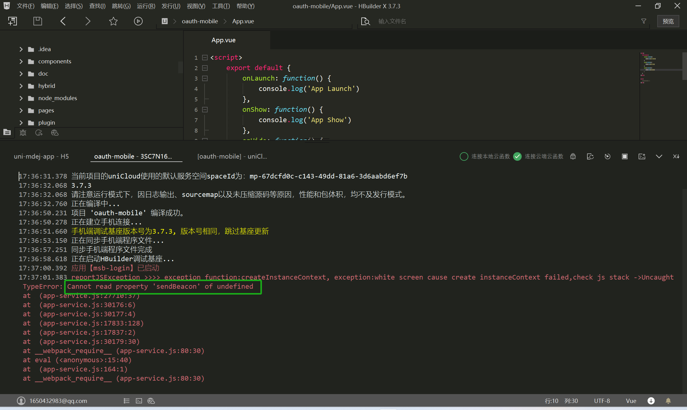

# uniapp 原生问题处理

### 一、问题记录

- 1.使用`自定义插座`运行到手机然而并没有实现正式包的定位效果。
  ```
  自定义基座里面已经有了app正式包的包名和证书，而且manifest里面已经配置了高德注册的key。
  但是定位还是失败，使用云打包后的包定位是没有问题的。
  ```
- 2.前端配置主题功能时：`image`图片的路径设置后，在浏览器上面可以正常加载出来，在手机上面却出不来。
- 3.使用`native.js`调用原生的功能进行测试时，本来使用`uniapp`项目直接运行进行测试比较方便。 但是测试一段时间后，运行就报错了`setBecome`属性没有所以就不能进行测试了。
  _`这种情况下：使用5+app-h5页面直接运行到手机进行测试比较靠谱`_


