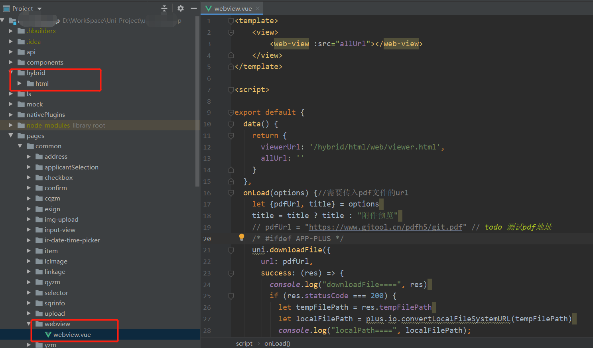

# uniapp项目在移动端打开Pdf文件

> 在最新的vue项目-公众号中使用了`pdfh5`库加载pdf文件，效果也不错而且更加简单。
>> 唯一问题就是：在微信打开时pdf会有缓存，浏览器没问题，具体在uniapp项目中效果还没有测试。
* 1.在package.json文件中依赖下面的库
  ```
  "pdfh5": "^1.4.2",
  ```
* 2.在页面中加入以下代码即可。
  ```
  import Pdfh5 from "pdfh5";
  import "pdfh5/css/pdfh5.css";
  
  const initPdf = () => {
    state.pdfh5 = new Pdfh5("#pdf-content", {
      pdfurl: state.pdfUrl,
      goto: 1,
      // 设置每一页pdf上的水印
      // logo: { src: require("@/assets/images/bus/icon_head@2x.png"), x: 420, y: 700, width: 120, height: 120 },
    });
    state.pdfh5.scrollEnable(true); // 允许pdf滚动
    // 监听pdf准备开始渲染，此时可以拿到pdf总页数
    state.pdfh5.on("ready", function () {
      console.log("总页数:" + this.totalNum);
    });
    // 监听pdf加载完成事件，加载失败、渲染成功都会触发
    state.pdfh5.on("complete", (status, msg, time) => {
      console.log("状态:" + status + "，信息:" + msg + "，耗时:" + time + "毫秒");
    });
  }
  ```
  
在uniapp项目打包的移动端应用中要打开Pdf文件，看了一圈没有uniapp的官方插件，
社区的插件中也都是收费的。


之前做的`5+`项目中，前端vue项目中使用`vue-pdf`库打开pdf，将项目编译打包后
再使用`Hbuilder`将前端资源打包到App中也是可以正常打开Pdf的。

这里想着`uniapp`项目和`5+`项目还是有区别的就没有尝试，网上介绍的都是使用`pdf.js`库
打开Pdf文件，但是讲的不是很清楚。经过一些尝试，我这里使用`pdf.js`打开pdf文件成功了。

### 一、使用步骤
相关参考：[uniapp-pdf.js使用总结]、[uniapp使用pdf.js(base64)]

结合上面的两个文档的内容，项目中使用`pdf.js`可以打开Pdf文件。

**项目结构如下：**

* 1.在项目根目录创建`hybrid/html`目录，将`pdf.js`相关资源放到其目录下。
我将`hybrid`目录压缩到这里了，可以直接下载使用：[hybrid.zip]
* 2.注册`webview`页面，在其中使用`pdf.js`打开pdf文件逻辑。
```
<template>
  <view>
    <web-view v-if="allUrl" :src="allUrl" :update-title='false'></web-view>
  </view>
</template>

<script>
export default {
  data() {
    return {
      viewerUrl: '/hybrid/html/web/viewer.html',
      allUrl: '',
      pdfUrl: "",
      title: '',
    }
  },
  onLoad(options) { //需要传入pdf文件的url
    console.log("webview==========", options)
    let {pdfUrl, title, show} = options
    uni.setNavigationBarTitle({title: options.title})
    // pdfUrl="http://mdej.impc.com.cn/hlwyy/business-ggfw/fileFeign/downloadFile?fileFullPath=/hlwyy/202305/10am/f1683680443628.pdf"
    this.pdfUrl = pdfUrl
    this.title = options.title
    this.loadPdf(this.pdfUrl, title)
  },
  methods: {
    loadPdf(pdfUrl, title) {
      /* #ifdef APP-PLUS */
      switch (uni.getSystemInfoSync().platform) {
        case 'android':
          console.log("loadPdf", '运行Android上');
          this.loadPdfOnAndroid(pdfUrl)
          break;
        case 'ios':
          console.log("loadPdf", '运行iOS上');
          this.loadPdfOnIos(pdfUrl)
          break;
        default:
          console.log("loadPdf", '运行在开发者工具上');
          break;
      }
      /* #endif */
      /* #ifdef H5 */
      this.allUrl = pdfUrl
      uni.setNavigationBarTitle({
        title
      })
      /* #endif */
    },
    async loadPdfOnAndroid(pdfUrl) {
      let tempFilePath = await this.downloadPdf(pdfUrl)
      let localFilePath = plus.io.convertLocalFileSystemURL(tempFilePath)
      console.log("downloadFile=======localFilePath", localFilePath)
      this.allUrl = this.viewerUrl + '?file=' + encodeURIComponent(localFilePath)
      console.log("downloadFile=======this.allUrl", this.allUrl)
    },
    async loadPdfOnIos(pdfUrl) {
      let tempFilePath = await this.downloadPdf(pdfUrl)
      uni.openDocument({
        filePath: tempFilePath,
        showMenu: true,
        success: function (res) {
          console.log('打开文档成功');
        }
      });
    },
    downloadPdf(pdfUrl) {
      return new Promise(resolve => {
        uni.downloadFile({
          url: pdfUrl,
          success: (res) => {
            if (res.statusCode === 200) {
              let tempFilePath = res.tempFilePath
              uni.getFileInfo({
                filePath: tempFilePath,
                success: async imgInfo => {
                  console.log("downloadPdf=======getFileInfo", imgInfo.size);
                  if (imgInfo.size) return resolve(tempFilePath)
                  else return resolve(await this.downloadPdf(pdfUrl))
                }
              })
            }
          },
          async fail(err) {
            return resolve(await this.downloadPdf(pdfUrl))
          }
        });
      })
    },
    onNavigationBarButtonTap() {
      var url = this.pdfUrl
      var title = ''
      let index = url.lastIndexOf(".")
      let titleTwo = url.lastIndexOf("/")
      title = this.title ? (this.title + url.substring(index, url.length)) : titleTwo
      console.log(title, '////');

      let dtask = plus.downloader.createDownload(url, {
            //本地路径开头使用file://，跟上手机文件本地目录storage/emulated/0，就是用户文件管理器能看到的了，之后我创建微垠作为文件夹，后缀是用于文件命名和格式修改，大家可以使用变量。
            filename: "file://storage/emulated/0/mdej/" + title //利用保存路径，实现下载文件的重命名
          },
          function (d, status) {
            //d为下载的文件对象
            if (status == 200) {
              //下载成功,d.filename是文件在保存在本地的相对路径，使用下面的API可转为平台绝对路径
              let fileSaveUrl = plus.io.convertLocalFileSystemURL(d.filename);
              plus.runtime.openFile(d.filename); //选择软件打开文件
              uni.showToast({
                title: '文件保存路径' + d.filename,
                icon: 'none',
                duration: 6000,
              })
            } else {
              //下载失败
              plus.downloader.clear(); //清除下载任务
            }
          })
      dtask.start();
    }
  }
}
</script>  
```
* 3.在其他页面打开pdf文件时，携带`pdfUrl`参数跳转到`webview`页面即可。
    ```
    this.$tools.pageGo("/pages/common/webview/webview?pdfUrl=" + "[pdf地址]"+"&title="+"[title文本]")
    ```
* 4.如果在加载pdf后要下载pdf文件的话，可以在标题栏后边显示下载按钮。
  ```
  在pages.json文件中配置标题栏右边的下载按钮，通过上面的onNavigationBarButtonTap方法实现下载功能
  {
      "path": "pages/common/webview/webview",
      "style": {
          "navigationBarTitleText": "",
          "enablePullDownRefresh": false,
          "app-plus": {
              "titleNView": {
                  "buttons": [{
                      "text": "下载",
                      "fontSrc": "./static/iconfont/iconfont.ttf",
                      "fontSize": "28rpx",
                      "width": "80rpx",
                      "z-index":999
                  }]
              }
          }
      }
  },
  ```
### 二、代码讲解
这里对于`webview`使用`pdf.js`实现打开pdf文件的原理不研究。

至于将`/hybrid/html`目录更换成其他目录是否可以成功还需要自行测试。

在[uniapp-pdf.js使用总结]这篇文档中介绍了打开pdf的几种方式，
其中有打开本地`pdf`文件的方法。
但是需要传入`/hybrid/html/web/viewer.html?file=`中的文件路径为本地文件路径。

这里的思路就是：
* 1.下载`pdf`文件到本地，得到`tempFilePath`临时路径
* 2.使用`plus.io.convertLocalFileSystemURL`方法转换成本地路径
    ```
    let localFilePath = plus.io.convertLocalFileSystemURL(tempFilePath)
    ```
* 3.使用`webview`加载`pdf.js页面路径及本地pdf文件路径`即可。

**打开效果：**


[hybrid.zip]:../../image/front/hybrid.zip
[uniapp-pdf.js使用总结]:https://ask.dcloud.net.cn/article/13407
[uniapp使用pdf.js(base64)]:https://www.jianshu.com/p/71328fe9f9ce
