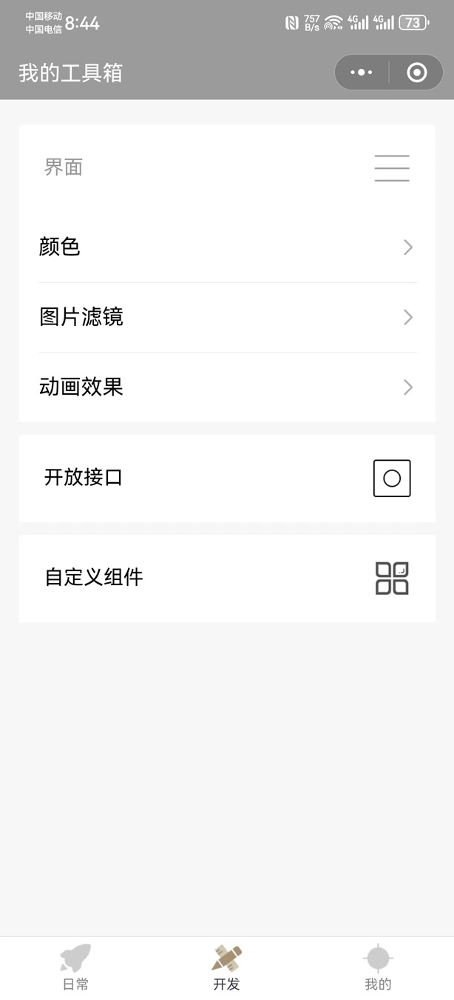
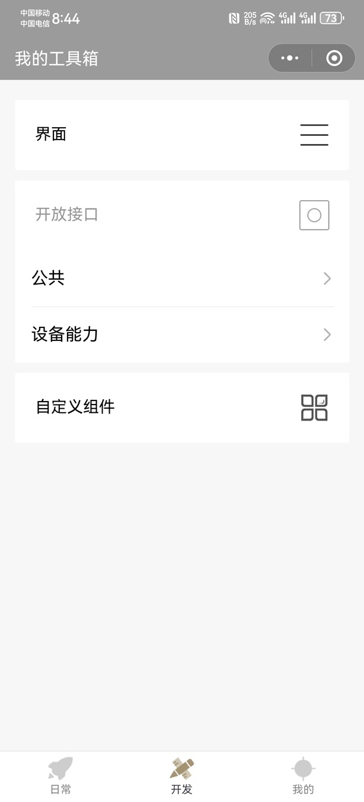
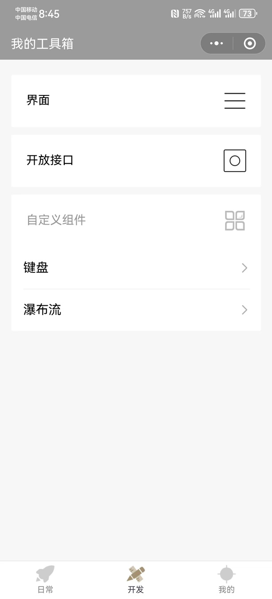
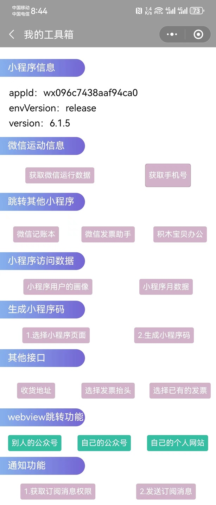
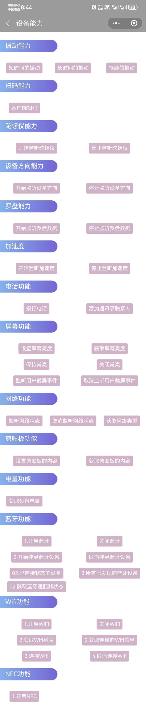
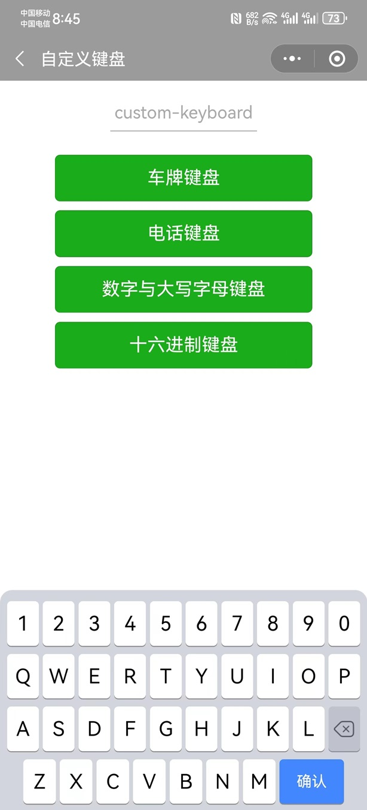
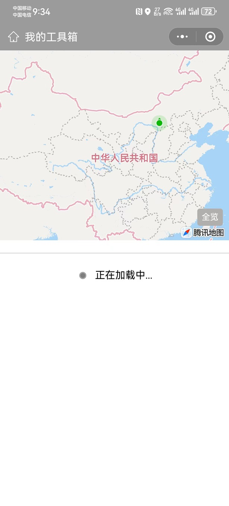

# 个人超级工具箱

项目地址：[Wx_Project/wxbook-yun][wxbook-yun]

项目使用的是微信小程序云开发，后面的收费比较贵所以接口部分的功能已经不能使用了，但是页面其他开发功能可以看。

### 一、首页

#### 1.书籍

#### 2.电影

#### 3.建议

#### 4.短视频

#### 5.照片识别

#### 6.翻译题

#### 7.诗词古文

### 二、开发

### 三、我的

[wxbook-yun]:https://gitee.com/zyjun/Wx_Project/tree/master/wxbook-yun
