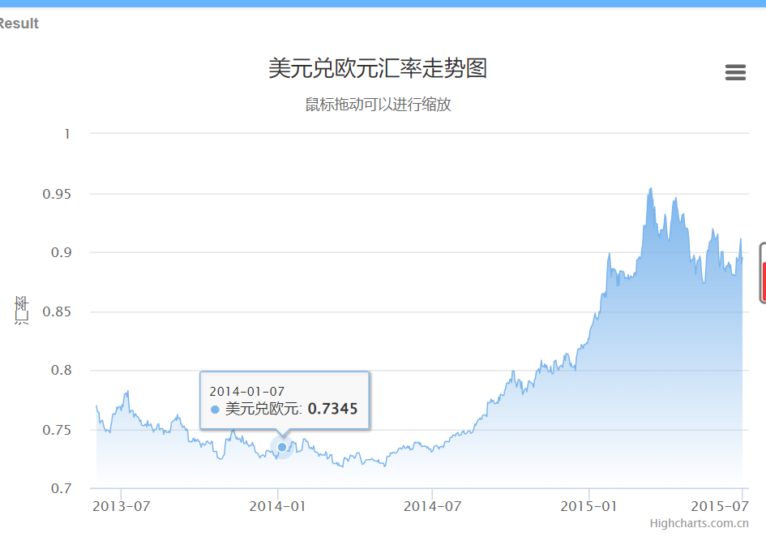
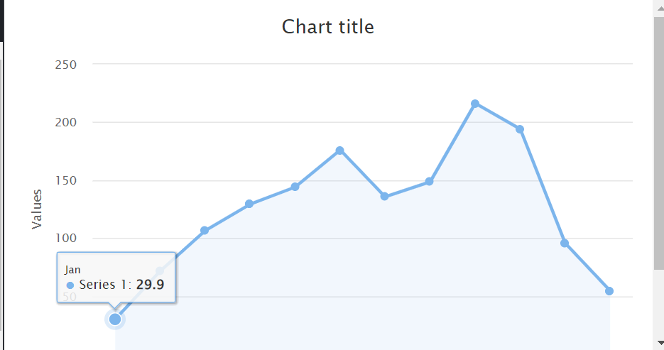
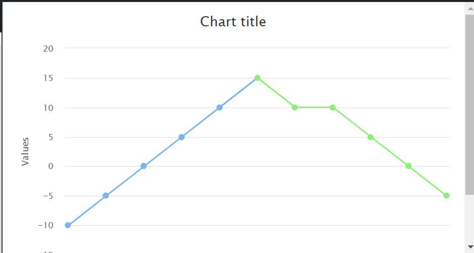
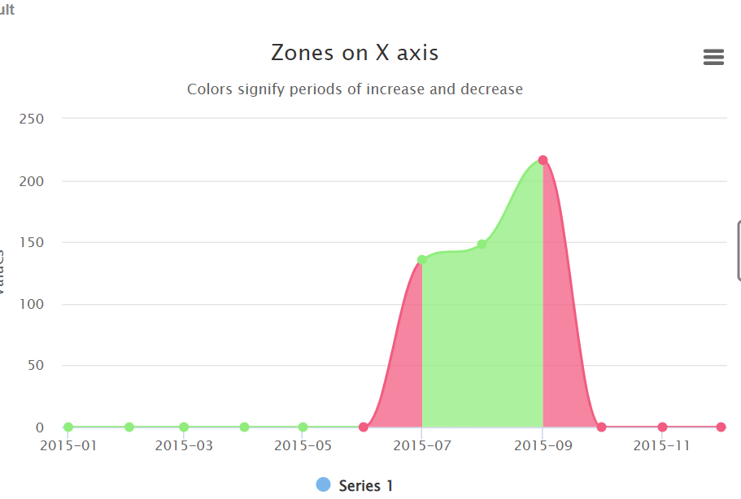

# highcharts

### 一、plotOptions-area

https://jshare.com.cn/demos/hhhhx1



```
plotOptions: {
	area: {
		fillColor: {
			linearGradient: {
				x1: 0,
				y1: 0,
				x2: 0,
				y2: 1
			},
			stops: [
				[0, new Highcharts.getOptions().colors[0]],
				[1, new Highcharts.Color(Highcharts.getOptions().colors[0]).setOpacity(0).get('rgba')]
			]
		},
		marker: {
			radius: 2
		},
		lineWidth: 1,
		states: {
			hover: {
				lineWidth: 1
			}
		},
		threshold: null
	}
},
series: [{
	type: 'area',
	name: '美元兑欧元',
	data: data
}]
```

### 二、area-plotOptions-series

https://jsfiddle.net/gh/get/library/pure/highcharts/highcharts/tree/master/samples/highcharts/plotoptions/area-fillopacity/



```
chart: {
    type: 'area'
},
plotOptions: {
    series: {
        fillOpacity: 0.1
    }
},
```


### 三、series-zoneAxis-zones

https://jsfiddle.net/dxegLfry/1/



```
series: [{
    data: [-10, -5, 0, 5, 10, 15, 10, 10, 5, 0, -5],
    zoneAxis:'x',
    zones: [{
        value: 0,
        color: '#f7a35c',
        fillColor:"#9CCB00"
    }, {
        value: 5,
        color: '#7cb5ec',
        fillColor:"#9CCB00"
    }, {
        color: '#90ed7d',
        fillColor:"#9CCB00"
    }]
}]
```

### 四、series-areaspline-zoneAxis、zones

https://jshare.com.cn/github/highcharts/highcharts/tree/master/samples/highcharts/series/color-zones-zoneaxis-x



```
series: [{
    type: 'areaspline',
	crisp:false,
    data: [0, 0, 0, 0, 0, 0, 135.6, 148.5, 216.4, 0, 0, 0],
    pointStart: Date.UTC(2015, 0),
    pointIntervalUnit: 'month',
    zoneAxis: 'x',
    zones: [{
        value: Date.UTC(2015, 5),
        color: colors[2]
    }, {
        value: Date.UTC(2015, 6),
        color: colors[5]
    }, {
        value: Date.UTC(2015, 8),
        color: colors[2]
    }, {
        color: colors[5]
    }]
}]
```
