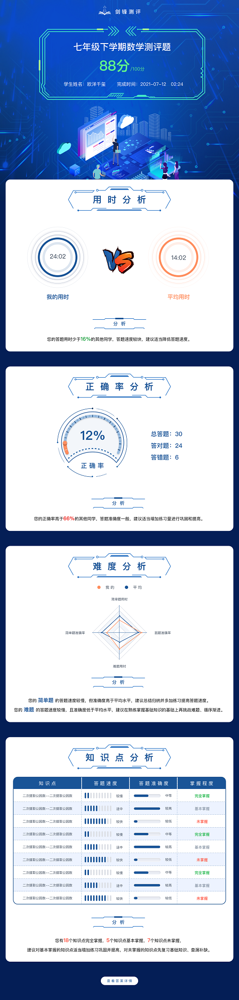
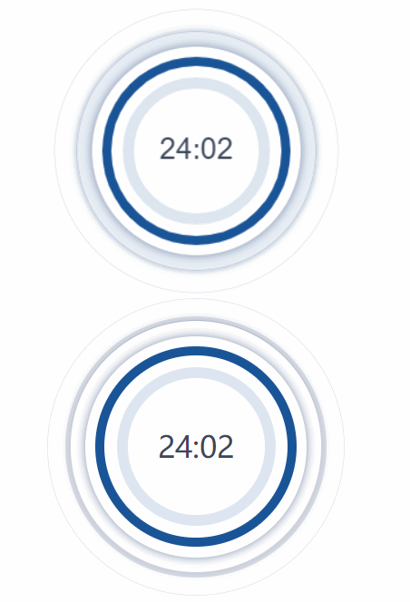
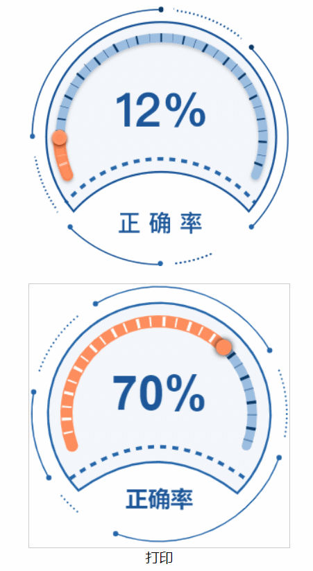
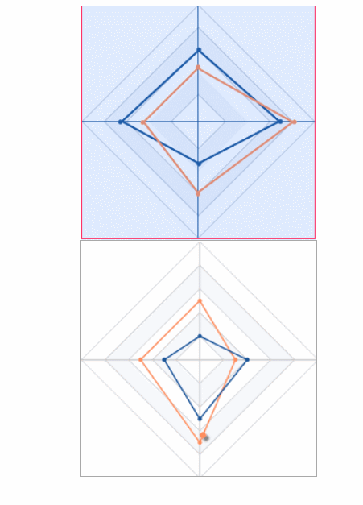

# H5-Canvas绘制带动画的图形

整体页面效果

### 一、项目路径及效果图
* 1、水波图效果
`代码地址：`[wave/index.html](../../../design/wave/index.html)

* 2.进度条效果
`代码地址：`[progress/index.html](../../../design/progress/index.html)

* 3.雷达图效果
`代码地址：`[progress/index.html](../../../design/radar/index.html)

### 二、具体的文档介绍

* 1、[水波图效果](../../../design/wave/README.md)
* 2.[进度条效果](../../../design/progress/README.md)
* 3.[雷达图效果](../../../design/radar/README.md)
