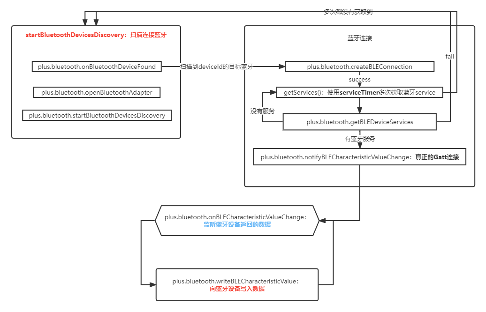

# NativeJs使用Gatt方式连接蓝牙

* 1.因为要在`Android手机`使用`NativeJs`代码进行测试蓝牙功能
* 2.而且这个`NativeJs`是需要有`Android`相应的原生插件的支持的
* 3.而`uniapp`项目运行到手机的原生代码正好是有这个原生插件功能的支持的。

基于以上的原因，项目是使用`uniapp`框架的项目上进行开发调试的。

> 项目地址：[bluetooth-h5][bluetooth-h5]

> 相关项目：[bluetooth-android][bluetooth-android]

**主要流程：**
* 1.连接蓝牙
* 2.蓝牙数据传输

### 一、连接蓝牙核心代码

>代码位置：[bluetooth-h5]项目-`pages/plus/blue-utils.js`

```
class BlueUtils {
    constructor() {...}

    canBlueToothUse(){//蓝牙硬件是否可用
        1.判断当前设备是否支持蓝牙，支持蓝牙则走下面的逻辑！
        this.blueToothError = await this.openLocationPermission()
        这里就可以使用await接收到【申请权限方法】的同步结果。
        2.判断定位权限是否存在，不存在则去请求权限，存在则走下面的逻辑！
        3.判断蓝牙功能是否打开，没打开则去申请打开，打开则走下面的逻辑！
        4.上面的功能在不满足的情况下就提示错误信息，并返回false结果。
    }

    //这个方法的作用就是统一日志输出。正常情况下只需要传入fn方法名及e有用信息两个参数即可
    //如果在【Promise】对象中使用时，先输出console日志，然后再通过【resolve】方法将【e有用信息】回调到【Promise】对象中。
    promiseBackSuccess(fn, e, back = null) {
      console.log(fn + "---success", e)
      if (back) back(e)
    }

    //上面的方法在这里有使用，目的就是在【Promise】中先输出日志，然后再将结果返回去。
    openLocationPermission() {//申请定位权限
      return new Promise((resolve, reject) => {
        plus.android.requestPermissions(['android.permission.ACCESS_FINE_LOCATION'],
            e => {
              if (e.deniedAlways.length > 0) this.promiseBackFail("requestPermissions_ACCESS_FINE_LOCATION", "定位权限被拒绝！", reject)
              if (e.deniedPresent.length > 0) this.promiseBackFail("requestPermissions_ACCESS_FINE_LOCATION", "定位权限被拒绝！", reject)
              if (e.granted.length > 0) this.promiseBackSuccess("requestPermissions_ACCESS_FINE_LOCATION", "", resolve)
            },
            err => {
              this.showToast("申请权限出错！")
              this.promiseBackFail("requestPermissions_ACCESS_FINE_LOCATION", JSON.stringify(err), reject)
            });
      })
    }
    
    //开启蓝牙扫描-连接方法
    startBluetoothDevicesDiscovery(){
        //1.判断蓝牙功能是否可用，不可用去申请相关权限或提示错误信息
        let blueToothUse = await this.canBlueToothUse()
        if (!blueToothUse) return
        //2.以下都是调用【plus的蓝牙扫描、扫描监听、连接方法】的完整流程
        this.listenBlueToothAdapter()【扫描监听放在扫描的前面】
        let openRes = await this.openBlueTooth()
        let startDisRes = await this.startDiscovery()
    }
    
    listenBlueToothAdapter(){
        plus.bluetooth.onBluetoothDeviceFound(e => {
            if (deviceObj.deviceId == this.deviceId) {
                this.connectDevice(success=> //扫描到目标蓝牙，进行连接操作
                    this.getServices(success=> //sccess：连接成功，获取蓝牙服务
                        if (services.length > 0) {//success:获取服务成功，并且服务存在：
                          this.listenValueChange(success=>
                            //到这里才是真正意义上的连接上蓝牙  
                            this.readValueListener()//监听蓝牙返回的数据
                          )
                          this.clearServiceTimer()
                        }
                    )
                )
            }
        })
    }
    
}
```

### 一、蓝牙数据传输流程




[bluetooth-h5]:https://gitee.com/zyjun/bluetooth-h5
[bluetooth-android]:https://gitee.com/zyjun/bluetooth
