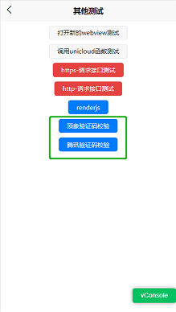
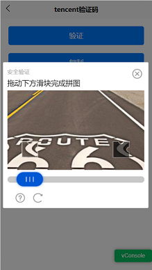
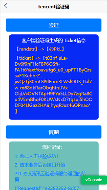
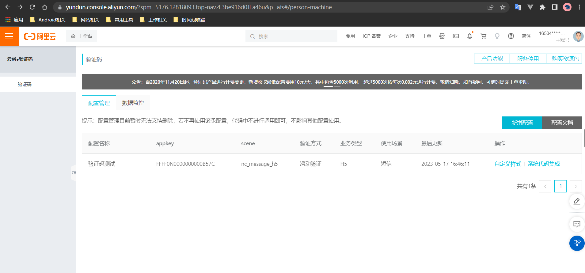
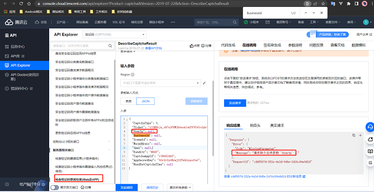
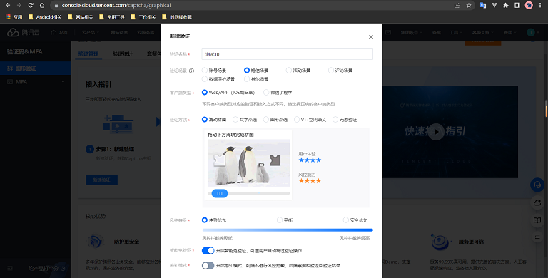
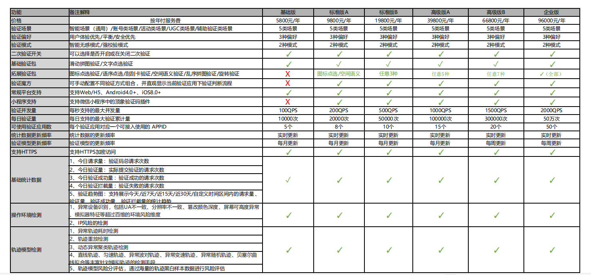

# 第三方验证码方案

目前实现的验证码demo效果：[https://m.zhaoyj.work/msb/#/pages/login/other](https://m.zhaoyj.work/msb/#/pages/login/other)





顶象的集成比较简单效果也一般，腾讯云的目前看着比较完善，阿里云的配置及文档比较简单(后台没有提供nodejs的sdk，没有接入测试)，百度的没有发现有相关功能。


### 一、参考网站

[验证码平台哪家强，六大验证码使用评测-2017 ](https://www.sohu.com/a/206286904_354899 )

[产品防护：5种常见的短信验证码防刷策略-2017](https://www.woshipm.com/pd/580976.html)

[验证码哪家好？主流验证码全面对比-2022](https://zhuanlan.zhihu.com/p/562828431)

### 二、验证码校验流程

* 腾讯验证码调用时序图
  
* 顶象验证码校验流程
  

```
简单说来：
1.【验证码客户端组件】实现的人工校验，校验通过生成一个token
2.用户请求自己的业务接口时使用token等信息先调用【验证码后台服务接口】判断是否是客户端生成的
3.校验通过再执行自己的相关业务逻辑
```

### 三、代码实现流程

* 顶象技术开发文档：
  [https://www.dingxiang-inc.com/docs/detail/captcha#doc-h3-20](https://www.dingxiang-inc.com/docs/detail/captcha#doc-h3-20)
* 腾讯技术开发文档：
  [https://cloud.tencent.com/document/product/1110/36841](https://cloud.tencent.com/document/product/1110/36841)

**使用腾讯云验证码过程**

后台配置相关：





**一、vue前端代码集成**

```
//页面按钮触发验证码功能
<button type="primary" @click="verifyYzm" style="margin-top: 20px">验证</button>


export function loadScript(url) {
  return new Promise((resolve, reject) => {
    const script = document.createElement('script')

    script.onload = () => resolve("load success")

    script.onerror = () => reject(new Error(`Load script from ${url} failed`))

    script.src = url
    const head =
        document.head || document.getElementsByTagName('head')[0]
    ;(document.body || head).appendChild(script)
  })
}
//加载TCaptcha.js
mounted() {
  if (typeof TencentCaptcha == 'undefined')
    loadScript("https://ssl.captcha.qq.com/TCaptcha.js", 'tencent')
        .then(res => {
          this.loadFinish = true
          console.log("loadScript=success", res)
        })
        .catch(err => {
          console.error("loadScript=error", err)
        })
},
methods: {
  verifyYzm() {
      this.logList.length = 0
      this.ticketInfo.length = 0
      let _this = this
      if (!this.loadFinish) uni.showToast({title: "js文件加载失败！"})

      // 定义回调函数
      function callback(res) {
        // 第一个参数传入回调结果，结果如下：
        // ret         Int       验证结果，0：验证成功。2：用户主动关闭验证码。
        // ticket      String    验证成功的票据，当且仅当 ret = 0 时 ticket 有值。
        // CaptchaAppId       String    验证码应用ID。
        // bizState    Any       自定义透传参数。
        // randstr     String    本次验证的随机串，后续票据校验时需传递该参数。
        console.log('callback:0000000000', res);

        // res（用户主动关闭验证码）= {ret: 2, ticket: null}
        // res（验证成功） = {ret: 0, ticket: "String", randstr: "String"}
        // res（请求验证码发生错误，验证码自动返回terror_前缀的容灾票据） = {ret: 0, ticket: "String", randstr: "String",  errorCode: Number, errorMessage: "String"}
        // 此处代码仅为验证结果的展示示例，真实业务接入，建议基于ticket和errorCode情况做不同的业务处理
        if (res.ret === 0) {
          // 复制结果至剪切板
          var str = '【randstr】->【' + res.randstr + '】    【ticket】->【' + res.ticket + '】';
          console.log("callback:11111", str)
          _this.ticketInfo.push('【randstr】->【' + res.randstr + '】')
          _this.ticketInfo.push('【ticket】->【' + res.ticket + '】')
          // _this.requestProcess('1' + res.ticket) //todo 后端校验不通过情况
          _this.logList.push("1. 前端人工校验成功！")
          _this.requestProcess(res.ticket)
        }
      }

      // 定义验证码js加载错误处理函数
      function loadErrorCallback() {
        var appid = '您的CaptchaAppId';
        // 生成容灾票据或自行做其它处理
        var ticket = 'terror_1001_' + appid + '_' + Math.floor(new Date().getTime() / 1000);
        callback({
          ret: 0,
          randstr: '@' + Math.random().toString(36).substr(2),
          ticket: ticket,
          errorCode: 1001,
          errorMessage: 'jsload_error'
        });
      }

      try {
        var captcha = new TencentCaptcha('198682483', callback, {});
        // 调用方法，显示验证码
        captcha.show();
      } catch (error) {
        // 加载异常，调用验证码js加载错误处理函数
        loadErrorCallback();
      }
  },
}
```

**二、nodejs后端代码集成**

```
// /tencent/index.js
const tencentcloud = require("tencentcloud-sdk-nodejs-captcha");
async function verifyTencentToken(token, ip_info) {
  return new Promise((resolve, reject) => {
    const CaptchaClient = tencentcloud.captcha.v20190722.Client;
    // 实例化一个认证对象，入参需要传入腾讯云账户 SecretId 和 SecretKey，此处还需注意密钥对的保密
    // 代码泄露可能会导致 SecretId 和 SecretKey 泄露，并威胁账号下所有资源的安全性。以下代码示例仅供参考，建议采用更安全的方式来使用密钥，请参见：https://cloud.tencent.com/document/product/1278/85305
    // 密钥可前往官网控制台 https://console.cloud.tencent.com/cam/capi 进行获取
    const clientConfig = {
      credential: {
        secretId: "xxx",
        secretKey: "xxx",
      },
      region: "",
      profile: {
        httpProfile: {
          endpoint: "captcha.tencentcloudapi.com",
        },
      },
    };
    // 实例化要请求产品的client对象,clientProfile是可选的
    const client = new CaptchaClient(clientConfig);
    const params = {
      "CaptchaType": 9,
      "Ticket": token,
      "UserIp": ip_info ? ip_info : "192.168.43.222",
      "Randstr": "@bEq",
      "CaptchaAppId": xxx,
      "AppSecretKey": "xxx"
    };
    console.log("verifyTencentToken=========params==========", params)
    client.DescribeCaptchaResult(params).then(
        (data) => {
          console.log("success", data);
          return resolve(data)
        },
        (err) => {
          console.error("error", err);
          return reject(err)
        }
    );
  })
}
module.exports = {
  verifyTencentToken
}

// index.js
const tencentClient = require("./tencent/index");
// 调用腾讯二维码校验模块功能
tencentClient.verifyTencentToken(ticket, ip_info)
```

### 四、各平台价格介绍

* 1.腾讯云：天御-验证码服务

|  次数包   | 有效期 |    配置费用     |
|:------:|:---:|:-----------:|
|  3万次   | 1年  |   300.00元   |
|  8万次   | 1年  |   600.00元   |
|  20万次  | 1年  |  1,000.00元  |
| 100万次  | 1年  |  2,000.00元  |
| 200万次  | 1年  |  2,700.00元  |
| 500万次  | 1年  |  5,700.00元  |
| 1000万次 | 1年  |  9,600.00元  |
| 5000万次 | 1年  | 44,000.00元  |
|  1亿次   | 1年  | 78,000.00元  |
|  5亿次   | 1年  | 322,000.00元 |
|  10亿次  | 1年  | 500,000.00元 |

* 2.阿里-验证码服务包

|   次数包   | 有效期 |    配置费用     |
|:-------:|:---:|:-----------:|
|  200万次  | 1年  |  3,000.00元  |
|  500万次  | 1年  |  6,000.00元  |
| 1000万次  | 1年  | 10,000.00元  |
| 5000万次  | 1年  | 45,000.00元  |
| 10000万次 | 1年  | 80,000.00元  |
| 50000万次 | 1年  | 325,000.00元 |

* 3.顶象验证码价格
  
