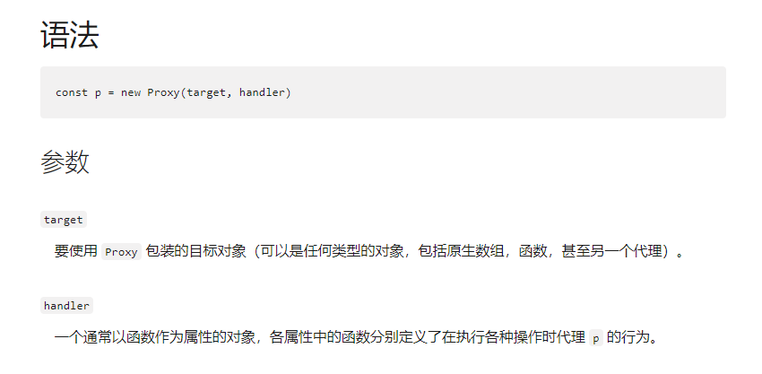
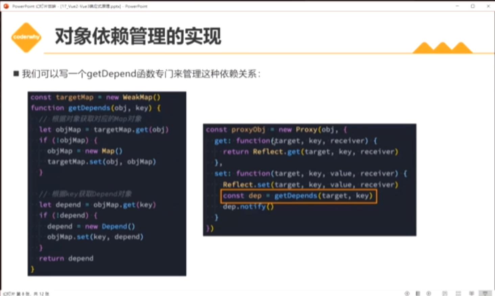

# Vue 的响应式

Vue2 使用了 Object.defineProperty()来实现响应式，Vue3 使用了 ES6 的 Proxy 来实现响应式。

**Object.defineProperty()**


**为什么 Vue2 中数组和对象的变动无法做到响应式？**

因为 defineProperty 中只有 `getter` , `setter`.没有`create`和`delete`。所以数组内部的操作和对象中的操作是无法监听到的

使用 definedProperty 有三个主要的问题

1. 不能监听数组的变化
   > 无法监听到下标的变化，导致数组下边添加元素不能实现响应
2. 不许遍历对象的每个属性
   > 只能劫持对象的属性，对每个对象的每个属性进行遍历
   > 如果属性值是对象，还需要深度遍历。Proxy 是劫持整个对象，并生成一个新的对象
3. 必须深层次遍历嵌套对象

**Proxy**



## **依赖收集和依赖分发**

**发布 - 订阅模式**
发布 - 订阅模式是一种设计模式，它定义了一种一对多的关系，让多个观察者对象同时监听某一个主体对象，当主体对象的状态发生变化时，它会通知所有观察者对象，使它们能够自动更新自己。
Vue3 的响应式原理就是基于发布 - 订阅模式实现的，它通过 Proxy 对象来代理原始数据对象，拦截其读取和修改的操作，从而实现对数据的依赖收集和依赖分发。

### 依赖收集

依赖收集的目的是为了简历数据和副作用函数之间的映射关系。让数据知道哪些副作用函数依赖于他，当数据变化是，通知副作用函数进行更新

<font color=mediumaquamarine size=3>什么是副作用函数（effect）</font>

副作用函数是指那些依赖于响应书数据变化而执行的函数。例如：

1. 渲染函数：负责将数据渲染至视图
2. 计算属性：依赖于响应式数据，当数据变化时，重新计算并返回新的值
3. 侦听器：监听响应式数据的变化，并在变化时执行回调函数
4. 自定义函数：在函数内部使用了响应式数据，当数据变化时，函数会重新执行

<font color=mediumaquamarine size=3>track 函数</font>

函数是 Vue3 响应式系统的核心部分之一，它的主要作用是跟踪对响应式对象属性的访问。

当你访问一个响应式对象的属性时，`track`函数会被调用。它会检查当前是否有一个活动的`effect（副作用函数）`。如果有，那么这个`effect`就会被添加到这个属性的依赖列表中。这样，当这个属性的值发生变化时，所有依赖于这个属性的`effect`就会被重新执行（trigger 函数）。

`track` 函数的实现如下：

```js
/**
 * 跟踪对响应式属性的访问。
 *
 * 这将检查当前正在运行的效果，并将其记录为dep，
 * dep记录了所有依赖于响应式属性的效果。
 *
 * @param target - 持有响应式属性的对象。
 * @param type - 定义对响应式属性的访问类型。
 * @param key - 要跟踪的响应式属性的标识符。
 */
export function track(target: object, type: TrackOpTypes, key: unknown) {
  // shouldTrack和activeEffect都为真时，才进行跟踪
  if (shouldTrack && activeEffect) {
    // 从targetMap中获取目标对象的依赖映射
    let depsMap = targetMap.get(target)
    // 如果目标对象没有依赖映射，则为其创建一个
    if (!depsMap) {
      targetMap.set(target, (depsMap = new Map()))
    }
    // 从依赖映射中获取属性的依赖
    let dep = depsMap.get(key)
    // 如果属性没有依赖，则为其创建一个
    if (!dep) {
      depsMap.set(key, (dep = createDep(() => depsMap!.delete(key))))
    }
    // 跟踪效果
    // activeEffect - 当前活动的效果
    // dep - 属性的依赖
    // __DEV__ ? {target, type, key} : void 0 - 在开发模式下，传递额外的调试信息
    trackEffect(
      activeEffect,
      dep,
      __DEV__
        ? {
            target,
            type,
            key,
          }
        : void 0,
    )
  }
}
```

### 依赖分发

> 依赖分发的目的是为了在数据发生变化时，触发依赖于该数据的副作用函数进行更新，从而实现数据和视图的同步。

`trigger`函数在 Vue3 的响应式系统中起着关键的作用，它负责在数据发生变化时触发更新。以下是`trigger`函数的详细工作流程：

- **获取依赖映射**.首先，`trigger`函数会从`targetMap`中获取目标对象的依赖映射。`targetMap` 是一个全局的 `WeakMap`，它存储了所有响应式对象及其对应的依赖映射。
- **确定需要触发的依赖**.然后，`trigger`函数会根据触发类型（`type`）和属性键（`key`）来确定需要触发的依赖。例如，如果触发类型是 `SET`，那么只有依赖于该属性的依赖会被触发。
- **触发依赖的效果**。trigger 函数会遍历所有需要触发的依赖，并执行其中存储的效果。这些效果通常是重新计算计算属性的值或重新渲染组件。

```js
/**
 * 找到与目标（或特定属性）相关的所有依赖，并触发其中存储的效果。
 *
 * @param target - 响应式对象。
 * @param type - 定义需要触发效果的操作类型。
 * @param key - 可用于定位目标对象中的特定响应式属性。
 */
export function trigger(
  target: object,
  type: TriggerOpTypes,
  key?: unknown,
  newValue?: unknown,
  oldValue?: unknown,
  oldTarget?: Map<unknown, unknown> | Set<unknown>
) {
  // 从targetMap中获取目标对象的依赖映射
  const depsMap = targetMap.get(target);
  // 如果目标对象没有依赖映射，说明它从未被跟踪过，直接返回
  if (!depsMap) {
    return;
  }

  let deps: (Dep | undefined)[] = [];
  // 如果操作类型是CLEAR，说明集合正在被清空，触发目标的所有效果
  if (type === TriggerOpTypes.CLEAR) {
    deps = [...depsMap.values()];
  } else if (key === 'length' && isArray(target)) {
    // 如果目标是数组且键名是'length'，则触发长度变化的效果
    const newLength = Number(newValue);
    depsMap.forEach((dep, key) => {
      if (key === 'length' || (!isSymbol(key) && key >= newLength)) {
        deps.push(dep);
      }
    });
  } else {
    // 对于SET、ADD、DELETE操作，触发相应的效果
    if (key !== void 0) {
      deps.push(depsMap.get(key));
    }

    // 对于ADD、DELETE、Map.SET操作，也要触发迭代键的效果
    switch (type) {
      case TriggerOpTypes.ADD:
        if (!isArray(target)) {
          deps.push(depsMap.get(ITERATE_KEY));
          if (isMap(target)) {
            deps.push(depsMap.get(MAP_KEY_ITERATE_KEY));
          }
        } else if (isIntegerKey(key)) {
          // 数组中添加了新索引 -> 长度变化
          deps.push(depsMap.get('length'));
        }
        break;
      case TriggerOpTypes.DELETE:
        if (!isArray(target)) {
          deps.push(depsMap.get(ITERATE_KEY));
          if (isMap(target)) {
            deps.push(depsMap.get(MAP_KEY_ITERATE_KEY));
          }
        }
        break;
      case TriggerOpTypes.SET:
        if (isMap(target)) {
          deps.push(depsMap.get(ITERATE_KEY));
        }
        break;
    }
  }

  // 暂停调度
  pauseScheduling();
  // 触发所有依赖的效果
  for (const dep of deps) {
    if (dep) {
      triggerEffects(
        dep,
        DirtyLevels.Dirty,
        __DEV__
          ? {
              target,
              type,
              key,
              newValue,
              oldValue,
              oldTarget,
            }
          : void 0
      );
    }
  }
  // 重置调度
  resetScheduling();
}
```

### **批量异步更新**

> 在 Vue 的响应式系统中，当数据发生变化时，trigger 函数会立即触发所有依赖于该数据的 effect。但是，如果在一个事件循环
> 中，同一个数据被多次修改，那么同一个 effect 就会被多次触发，这可能会导致不必要的计算和渲染。Vue 是如何解决这个问题
> 的？如果你要设计一个批量异步更新的机制，你会如何设计？

Vue 使用了一个异步队列来实现批量异步更新。当数据发生变化时，Vue 并不会立即触发更新，而是将需要更新的 `watcher` 添加到一个队列中。然后，Vue 会在事件循环的下一个 `tick` 中，清空这个队列并执行所有的 `watcher`。这样，如果在一个事件循环中，同一个数据被多次修改，同一个 `watcher` 也只会被执行一次。此外，**由于 Vue 在执行 watcher 之前会对队列进行排序，保证了父组件总是在子组件之前更新，计算属性总是在其依赖的属性之前更新，从而避免了不必要的重复更新。**

### 依赖管理的数据结构(简单原理，非 vue 底层源码)



1. weakMap: 存储响应式对象和它的依赖关系
2. Map: 存储响应式对象的属性和它的依赖关系
3. Set: 存储依赖关系中的副作用函数

创建依赖类 Depend 来管理依赖

```js
// 依赖类
class Depend {
  constructor() {
    this.effects = new Set();
  }
  // 添加依赖
  addDepend(fn) {
    if (fn) {
      this.effects.add(fn);
    }
  }
  // 添加依赖2
  depend(){
    if (activeEffect) {
      this.effects.add(activeEffect);
    }
  },
  // 通知依赖函数执行
  notify() {
    this.effects.forEach((effect) => {
      if (typeof effect === 'function') {
        effect();
      }
    });
  }
}
//监听对象的变化
let activeEffect = null
function watch(fn){
activeEffect = fn
  fn()
  activeEffect = null
}

// 专门管理依赖的函数
let targetMap = new WeakMap();
function getDepend(obj, key) {
  // 获取对象对应的依赖映射
  let objMap = targetMap.get(obj);
  if(!objMap){
    objMap = new Map();
    targetMap.set(obj, objMap);
  }
  // 获取对象属性对应的依赖
  let dep = objMap.get(key);
  if (!dep) {
    dep = new Depend();
    objMap.set(key, dep);
  }
  return dep;
}

```

**Vue2**

```js
function reactive(obj) {
  Object.keys(obj).forEach((key) => {
    let value = obj[key];
    Object.defineProperty(obj, key, {
      get() {
        //收集依赖
        const dep = getDepend(obj, key);
        dep.depend();
        return value;
      },
      set(newValue) {
        value = newValue;
        //触发更新
        const dep = getDepend(obj, key);
        dep.notify();
      },
    });
  });
  return obj;
}
```

**Vue3**

```js
function reactive(obj) {
  return new Proxy(obj, {
    get(target, key, reciever) {
      //收集依赖
      const dep = getDepend(target, key);
      dep.depend();
      return Reflect.get(target, key, reciever);
    },
    set(target, key, newValue, reciever) {
      //触发更新
      const dep = getDepend(target, key);
      dep.notify();
      Reflect.set(target, key, newValue, reciever);
    },
  });
}
```
