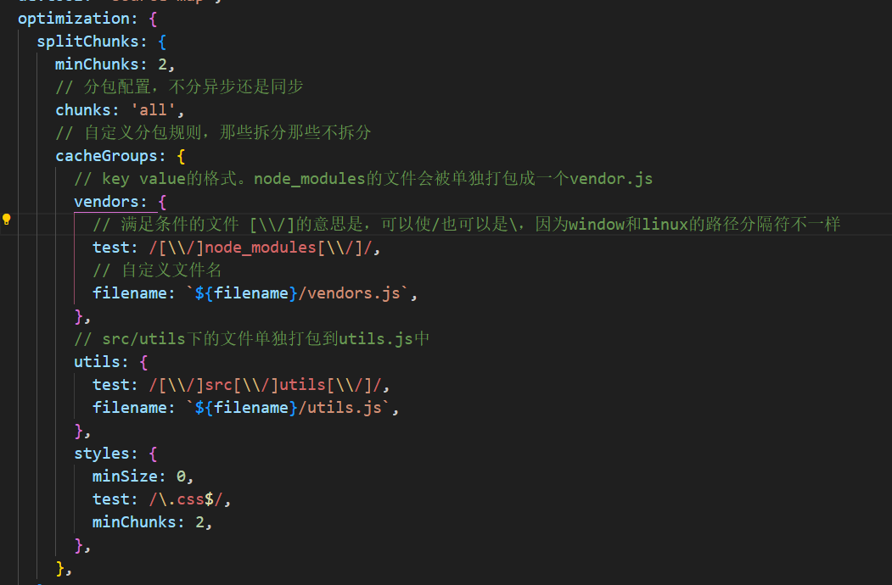
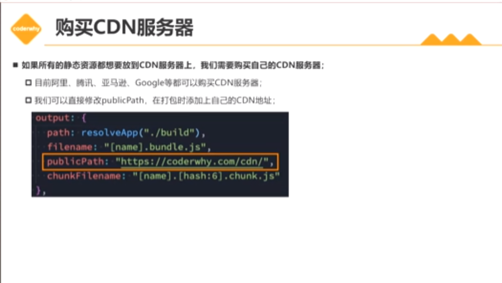

# 性能优化

## 打包后的结果进行优化

### 分包处理（路由懒加载） splitChunkPlugin / import 函数

1. 方式一代码分离

   **不分包弊端：**

   - 都放在一个 `bundle` 不方便管理
   - `bundle.js` 包非常大，影响首屏加载速度，使用户长时间看到的都是空白页面

   **解决方法：**

   - 把业务代码、第三方包（`node_modules`）和业务代码、`webpack` 为了支持运行时模块化生成的运行时代码分开打包。首屏只加载需要的 `bundle`,其他模块需要的时候在加载，或者网络空闲时利用 `prefetch` 加载

   - `SSR` 加快首屏速度，优化 `seo`

   

2. 方式二动态导入

   使用 `import` 导入模块，`webpack` 默认会将 `import` 的模块单独打包成一个文件，在需要的时候加载

3. 方式三 `splitChunkPlugin`

   `webpack` 内置的 `splitChunkPlugin` 插件，可以手动配置如何分包 optimization.splitChunks 的 chuncks 设置为 all，就会把所有模块都进行分包，不分异步还是同步。
   

4. 方式四 `prefetch` 和 `preload`

   - `prefetch` 网络空闲时加载
   - `preload` 当前页面需要加载

### 代码压缩

### 删除无用代码（tree-shaking）

### CDN 服务器加载 需要 购买 CDN 服务器

[CDN 地址](https://leetcode.cn/problems/132-pattern/)

## 打包速度优化

1. cache 缓存
2. exclude 缩小又换范围

`webpack` 动态导入 `import` 加快首屏速度
prefetch 和 preload
