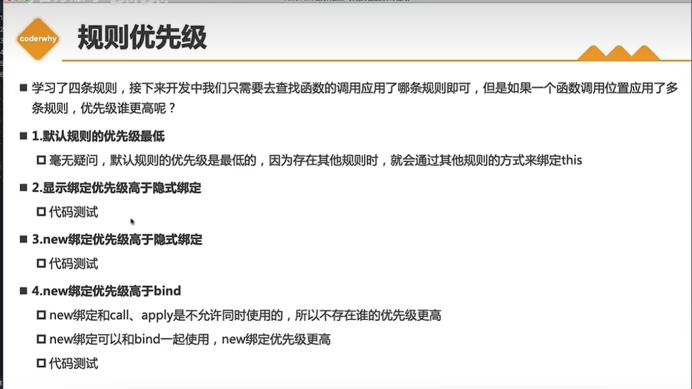

## this 的指向问题

### 1. 全局环境

全局环境中的 this 指向 window

```js
console.log(this === window); // true
```

### 2. 普通函数

普通函数中的 this 指向 window,需要注意的是在严格模式下 this 会指向 undefined

```js
function foo(name) {
  console.log(this.name); //undefined
  console.log(this === window); // true
}
foo('张三');
```

### 3. 对象方法

指向调用函数的那个对象，this: 谁调用我，我就指向谁

```js
var obj = {
  name: '张三',
  foo: function () {
    console.log(this); //{name: '张三', foo: ƒ}
  },
};
obj.foo();
```

**如果独立调用，this 还是指向 window**

```js
// 延用上面的例子,修改调用方式

let bar = obj.foo;

bar(); //window
```

**使用 `apply` ,`call` ,`bind` 调用**

```js
obj.foo.apply('李四'); //String {'李四'}

obj.foo.call('李四'); //String {'李四'}

let fn = obj.foo.bind('李四');
fn(); //String {'李四'}
```

### 4. 构造函数

构造函数配合 `new` 使用, 而 `new` 关键字会将构造函数中的 `this` 指向实例化对象

```js
function Person(name) {
  console.log(this); //Person {name: '张三'}
  this.name = name;
}
var p = new Person('张三');
console.log(p.name); //张三
```

### 5. 箭头函数

箭头函数没有自己的 `this`，会继承父作用域的 。
上面代码箭头函数的 `this` 继承 `fn()` 的 `this`，因为 **fn 普通函数的 this 指向 window**，所以此箭头函数指向 `window`，**又因为 var 的变量会挂载到 window 对象上**，所以 `this.num `输出 `10`。(注意：这里不用 var 用 let 或 const 的话输出结果为 undefined)

```js
var num = 10;
let name = '站三';
function fn() {
  var num = 20;
  setTimeout(() => {
    console.log('箭头函数的this', this); //window
    console.log(this.num); // 10
    console.log(this.name); //undefined
  }, 100);
}
fn();
```

### 6. 绑定事件函数的 this

this 指向 btn 这个按钮，谁调用就指向谁。

```js
<button>点击按钮</button>;

const btn = document.querySelector('button');

btn.addEventListener('click', function () {
  console.log(this); // btn
});
```

### 7.优先级


